GPF User Interface
==================

This guide provides a brief overview of the GPF user interface and the
available tools.

Upon accessing the GPF instance, the user is greeted by the Home page, which
includes a brief description of the instance(fig. 1.1), a shortcut to the
`Gene Profiles`_ tool(fig. 1.2), and a list of all configured
datasets (fig. 1.3). Each dataset represents a group of families along with
the available phenotypic and/or genotypic data for their members. Next to
each dataset the user can find a set of icons(fig. 1.4) providing useful
details such as the presence of de novo or transmitted variants, the
availability of phenotype data, and other relevant information. Note that
access to some of the datasets may be restricted; users may log into their
account or contact an administrator if access has not yet been granted.
The top bar(fig. 1.5) can be used to navigate between different pages of GPF.

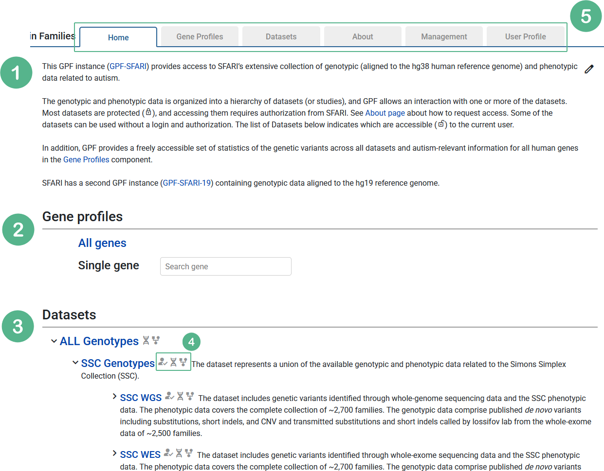

    Figure 1

On the datasets page, the user can click on the dataset dropdown menu in order
to navigate between different datasets.

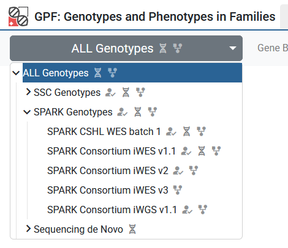

Each dataset has its own selection of available tools, which are organized as
tabs. The availability of these tools depends on the configuration of the
dataset.

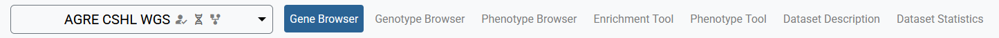

Dataset Description
-------------------

The Dataset Description tool provides an overview of a dataset.
It can contain information such as the reasons it was made, its size and scope,
details of the technology used to generate its data, rules for access, relevant
references and etc.

The description is in Markdown format and can be edited directly from the
browser.

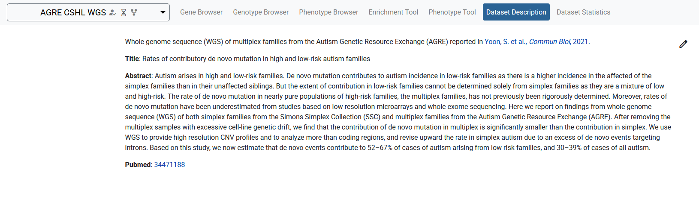

Dataset Statistics
------------------

The Dataset Statistics tool provides various overviews of the families in the
dataset. Download is available for all pedigree files in a `.ped` format.

Families by number
##################

A table with the amount of individuals, separated by phenotype and sex.

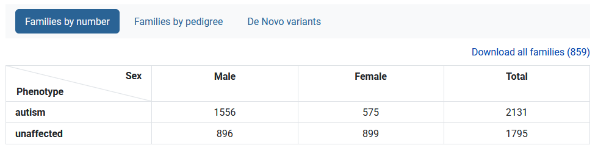

Families by pedigree
####################

This view presents a table listing all observed pedigree types along with the
number of families for each. Each pedigree is clickable, revealing the
corresponding family IDs and a download link.

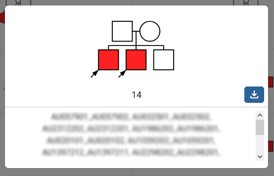

The table can be filtered by various tags available at the upper-left corner
(fig. 2.1, 3). The filtered families can then be downloaded via the download
button (fig. 2.2). Additionally, a legend describing the phenotypes can be
toggled from the bottom-right corner (fig. 2.3).

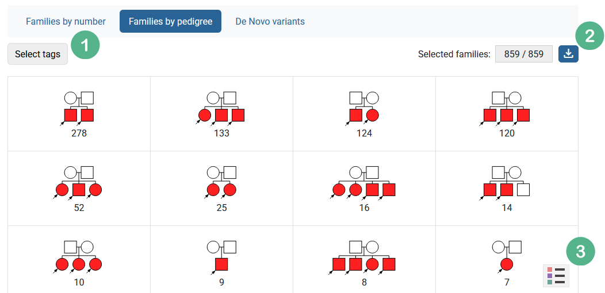

   Figure 2

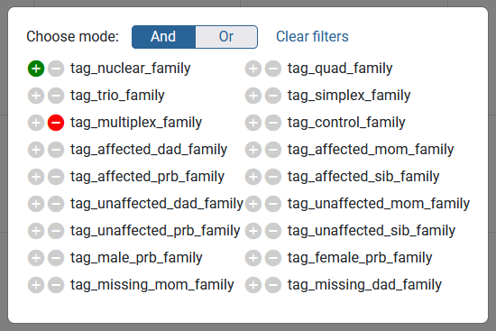

   Figure 3

De Novo variants
################

Provides a table with the rates of de novo variants, split by variant effect
type and the individual's diagnosis.

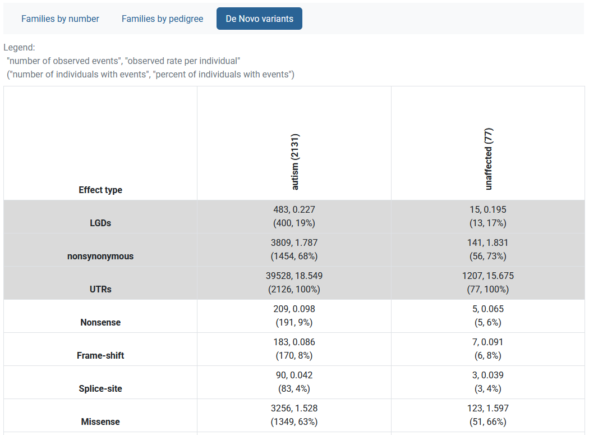

Gene Browser
------------

The Gene Browser tool can be used to graphically display a gene's structure
(exomes, introns, transcripts) and the dataset's variants found on it.

The variants can be filtered by different properties. The user can hover over
each variant on the plot to show additional information.
The plot can be zoomed (by click-and-drag) to select specific variants in a
region. Below the plot is a table showing the currently selected variants.
Two download buttons are provided - for summary and family variants.

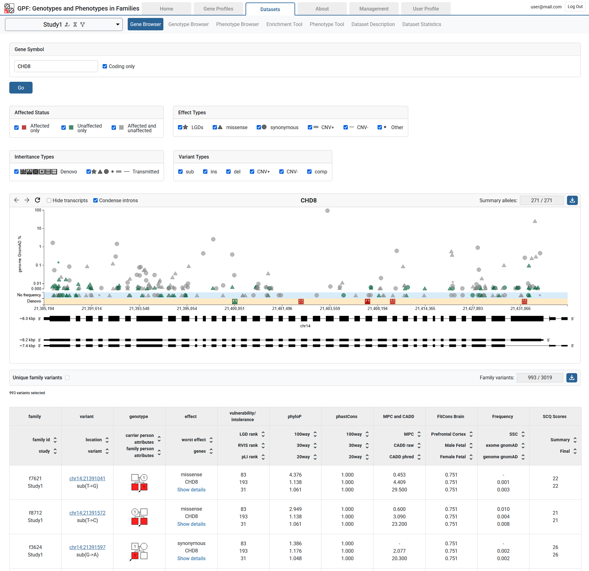

Genotype Browser
----------------

The Genotype Browser tool provides a powerful query interface to the dataset's
genetic variants. Users can filter by properties of the variants, such as:

   - Their type (SNP, short indel, CNV)
   - Their effect on proteins (i.e. missense, synonymous, LGD, etc.)
   - Whether they are de novo or transmitted, and their frequency
   - Genomic scores assigned to variants (i.e. phyloP, CADD, MPC, etc.)
   - The genes targeted by the variant and the family the variant occurs in

Additionally, the user can filter by properties of the target genes, such as:

   - Protection scores (pLI, RVIS, etc.)
   - Pathway membership
   - SFARI Gene score and phenotypic properties associated with individuals in
     the dataset families

More information on the filters can be found :ref:`here<Filters>`.

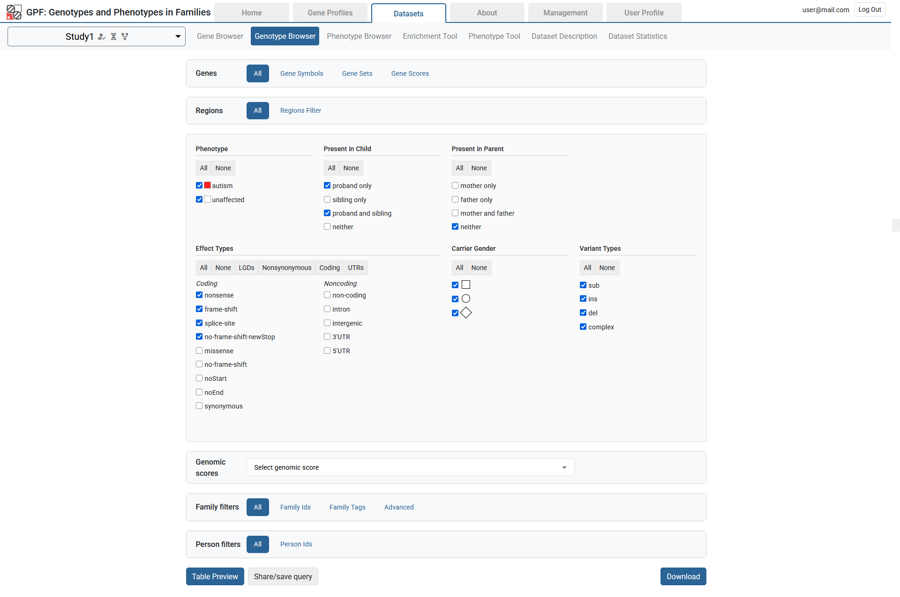

After the query is set up, the user can preview the variants of interest within
the website or download them as an Excel file for further analysis.

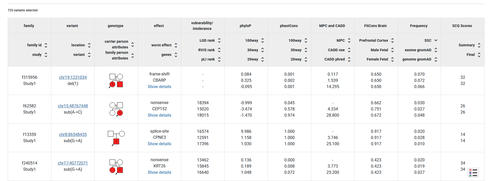

Queries can be shared via the "Save/share query" button or saved for future
work.

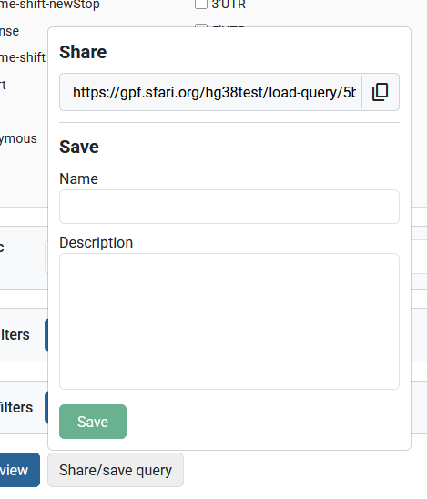

Phenotype Browser
-----------------

The Phenotype Browser tool shows the phenotypic data associated with a data
set. The data is organized by instruments applied to individuals, where
each instrument has a set of measures.
These measures are displayed in a table alongside their histograms across
the individuals in the datasets (split by role and diagnosis).
An instruments dropdown and a search are provided.
The table can be downloaded as a spreadsheet file.

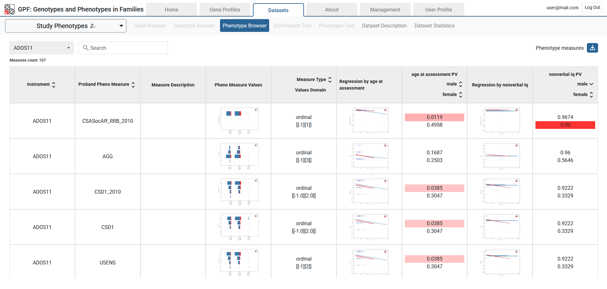

Enrichment Tool
---------------

The Enrichment Tool allows the user to test how strongly a given set of genes
are affected by de novo mutations.

Such an approach has been used to demonstrate that
there is functional convergence of de novo mutations in autism (i.e., damaging
de novo mutations in children with autism target synaptic genes and genes
encoding chromatin modifiers) and that the de novo mutation in autism targets
similar genes as the de novo mutation in intellectual disability and epilepsy.
The same technique was applied in studies of various other disorders.
Moreover, users can use the Enrichment Tool to tests hypotheses driven by
their own research against the large amount of genetic data managed by GPF.
To use the tool, the user has to choose a gene or a set of genes to test.
Enrichment models can be applies as additional normalization criteria.

Background models
#################

Selecting an appropriate background model for the Enrichment Tools is
crucial for the proper use of the tool and the accurate interpretation of its
results. We strongly recommend that users verify the selection of a reasonable
background model by using control experiments involving synonymous variants
and/or unaffected individuals.

The enrichment tool supports two different classes of background models.
The first class covers models that provide the expected number of de novo
mutations per haplotype and generation for each gene. One such model, described
in `Samocha et al. Nat Genet, 2014 <https://pubmed.ncbi.nlm.nih.gov/25086666/>`_,
is the “Samocha's enrichment background model.”
At its core, this model uses the expected mutation rates per nucleotide,
conditional on the surrounding nucleotide triplets, and aggregates these
nucleotide rates over the body of the gene to compute the expected number
of LGD, missense, and synonymous mutations. The Enrichment Tool then
accumulates the gene-level expectation across the genes within the tested
gene set to compute the expected number of mutations within the selected
gene set. It calculates an enrichment p-value based on the expected and
the observed number of mutations using a Poisson distribution. The data
for the “Samocha's enrichment background model” is conveniently wrapped
up as a resource in our public GRR
(`enrichment/samocha_background <https://grr.iossifovlab.com/enrichment/samocha_background/index.html>`_)
and can, thus, be easily configured as a background model in any GPF instance.

The second class of background models comprises models that utilize a
normalization weight for each gene to calculate the proportion of variants of
a given type that are expected to fall within the selected gene sets. These
models then utilize a binomial distribution to calculate p-values based on
the observed overlap and expected proportions. In the past, we have used
various types of normalization weights, including those based on the coding
length of genes
`Iossifov et al., Nature, 2014 <https://www.nature.com/articles/nature13908>`_
and those based on the number of synonymous variants
`Iossifov et al., Neuron, 2012. <https://pubmed.ncbi.nlm.nih.gov/22542183/>`_
The weights based on the number of variants can more accurately account for
biases in the sequencing technology (i.e., exome capture of a particular
design) when the analyzed dataset uses the same technology as the one used
to build the background model. In our public GRR, we provide several gene
weight resources for use in configuring the Enrichment Tool background models.
For example,
`hg38/enrichment/coding_length_ref_gene_v20170601 <https://grr.iossifovlab.com/hg38/enrichment/coding_length_ref_gene_v20170601/index.html>`_
is based on the coding gene length in refGene gene models, and
`hg38/enrichment/ur_synonymous_SFARI_SSC_WGS_CSHL <https://grr.iossifovlab.com/hg38/enrichment/ur_synonymous_SFARI_SSC_WGS_CSHL/index.html>`_
includes the counts of the ultra-rare synonymous variants we identified
through whole-genome sequencing in the ~5,000 parents from the
Simons Simplex Collection.

The Enrichment Tool also enables users to select the object to be counted
when measuring the enrichment of a specific gene set. Users can choose to
count the number of genetic variants or the number of genes covered by these
variants. In most cases, counting variants is the more appropriate approach.
Still, in certain situations with strong regional biases in de novo rates,
it may be more effective to count the number of genes. It is worth repeating
that one should always verify the choice of specific enrichment model by
using appropriate controls.

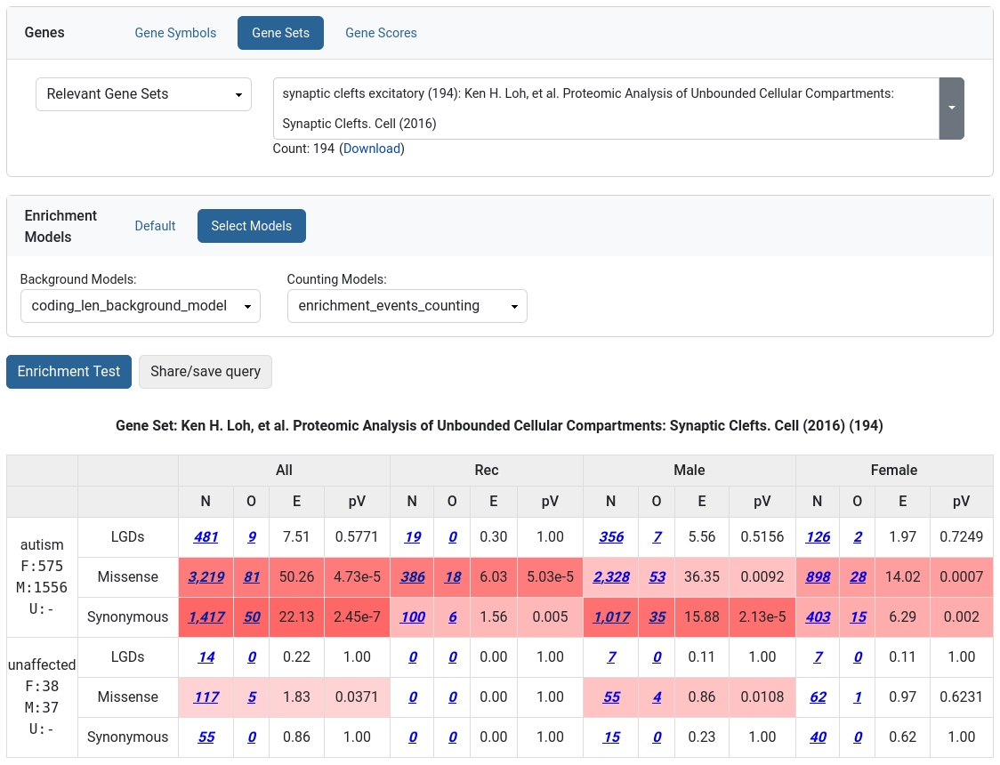

Phenotype Tool
--------------

The Phenotype Tool is used to study correlation of variants in gene sets and
phenotype measures. To produce a report, the user selects a phenotype measure
and optional measures to normalize by. Additional :ref:`filters<Filters>`
are also provided. The results are available for downloading.

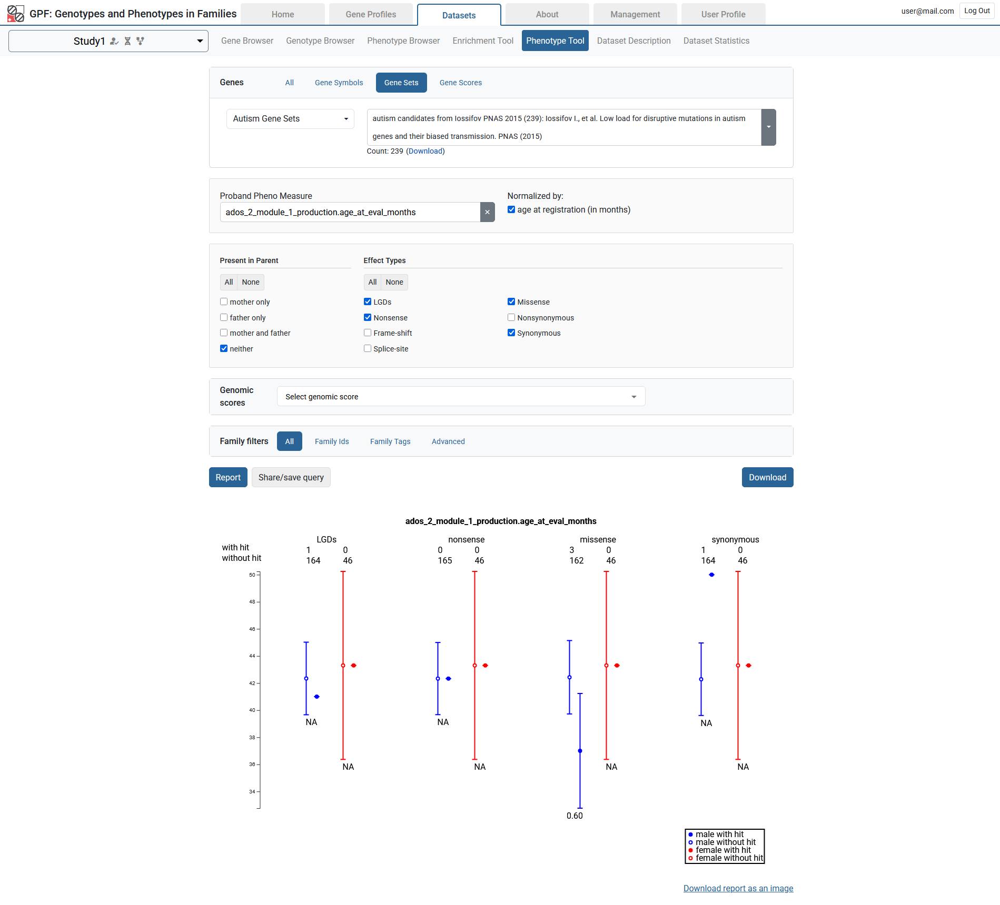

.. _gene-profiles:

Gene Profiles
--------------------

The Gene Profiles tool can be used to view a table of statistics about genes
in the configured datasets. The table is interactive - columns can be sorted,
toggled and reordered.

.. video:: ../_static/gene-profiles.mp4
    :width: 100%

Each gene symbol can be clicked to open the single view for that gene.
Some of the columns represent a statistic for a dataset - their cells can
be clicked to open the corresponding genotype browser query.
Rows can be highlighted using the middle mouse button or
CTRL / ⌘ + click. Highlighted genes are listed in the bottom right
and can be opened for comparison (fig. 4).

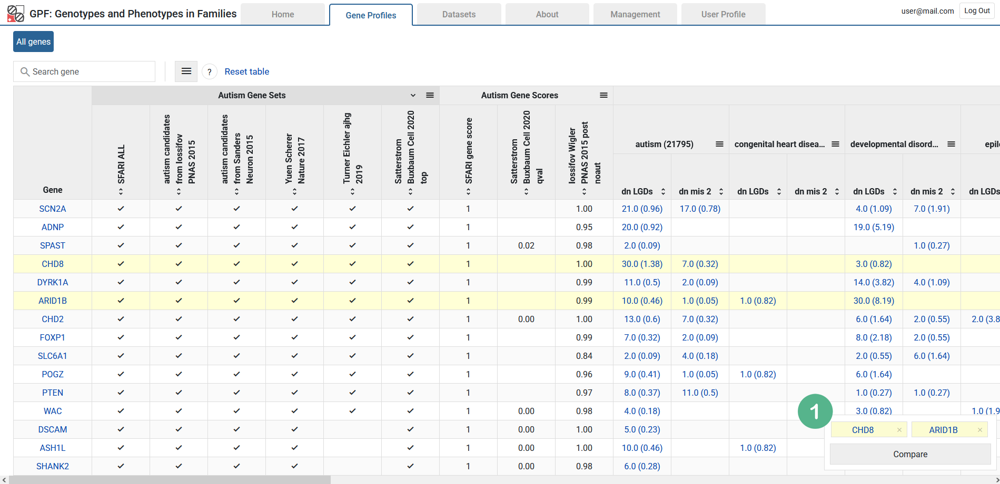

   Figure 4

Gene Profiles - single view
##################################

The single view is a dedicated view for one or more genes. It contains the
information you'd find in the table, but presented in more detail.
For example, scores are presented in the context of the histogram for the
whole range of score values. There are also useful links for external
resources such as the UCSC Genome Browser.

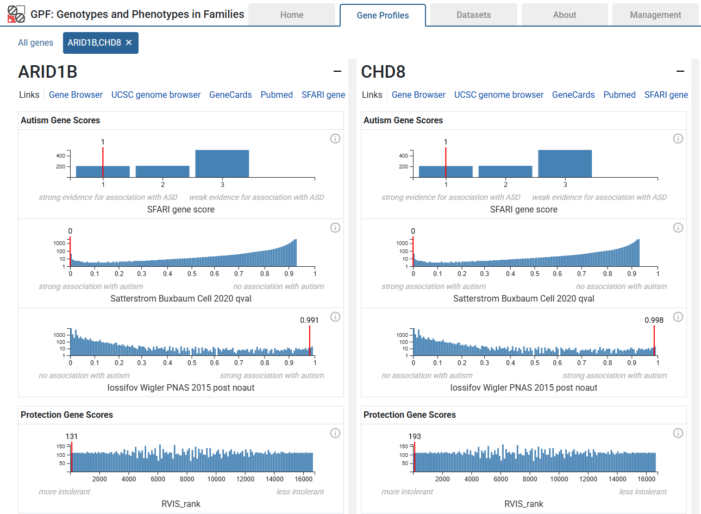

Filters
-------

Below is a list of the available filters in GPF.

General Filters
###############

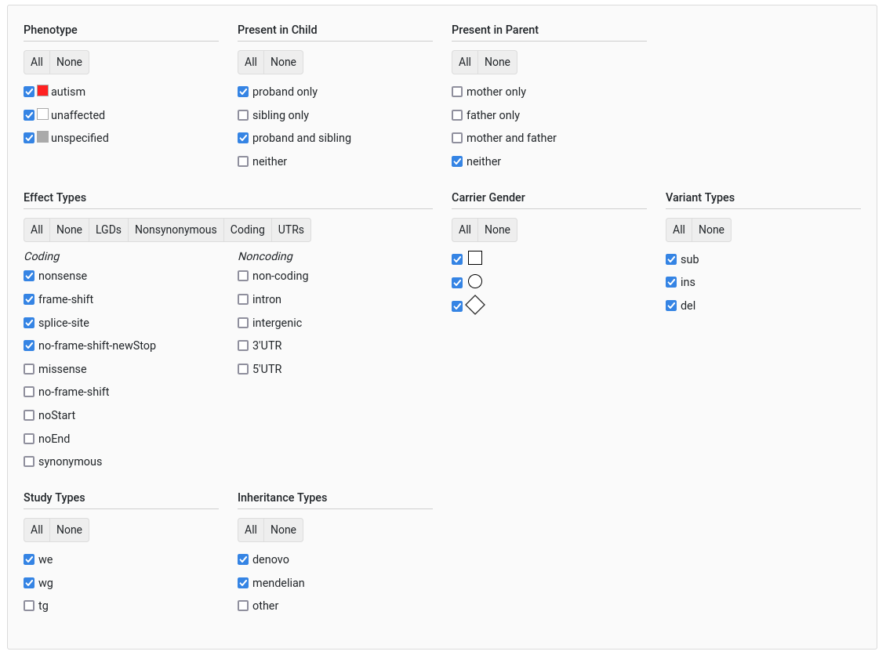

   General filters

Present in parent
+++++++++++++++++

This filter allows querying whether the variant is found in a parent and the
frequency with which it occurs.
When choosing the frequency, the user can select:

- All variants (via "all")
- Variants that occur less than X % (via "rare")
- Variants that occur between X and Y % (via "interval")
- Variants that occur in only a single individual (via "ultraRare")

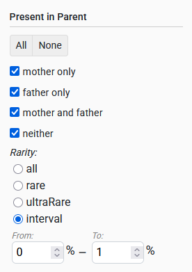

Pedigree selector
+++++++++++++++++

The pedigree selector has a dropdown to choose a criteria from:

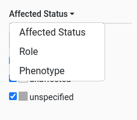

Gene symbols filter
###################

Specific genes can be queried for using this filter.
Gene symbols can be listed as comma or newline separated values.

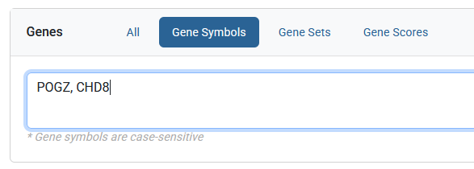

Gene sets filter
################

This filter allows the user to limit his query to a specific set of genes.
We provide collections of published gene sets as well as sets based on
de novo variants in our datasets. A download link is available for the
selected gene set.

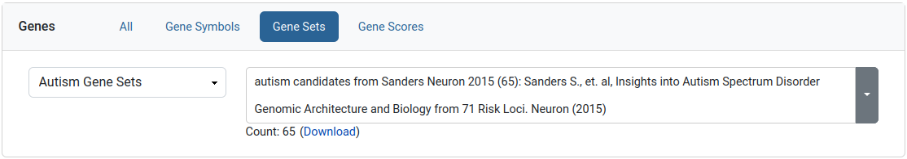

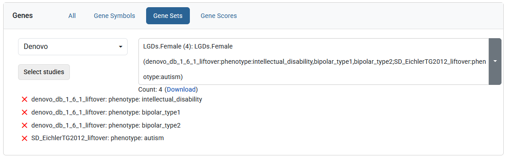

Gene scores
###########

This filter allows the user to limit his query to a range of values for a
given gene score. The gene score is presented as a histogram with two sliders
which can be moved to select a range. The text next to the left and right
sliders represents the amount of genes excluded from the selection.
The text in the middle is the amount of genes that are selected.
A download link is available for the gene scores.

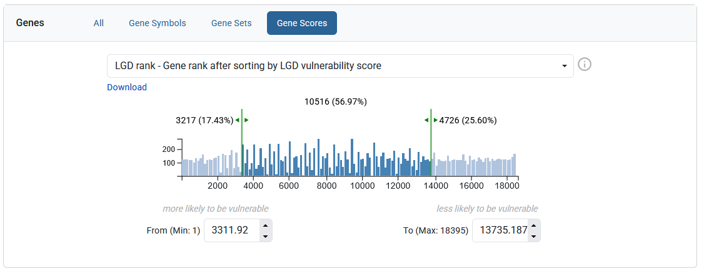

Regions filter
##############

This filter can be used to limit the query to a specific genomic region.
The format is a comma or a newline separate list of a region strings.
Each region string follows a "CHR:POS" or "CHR:POS_BEG-POS_END" format.

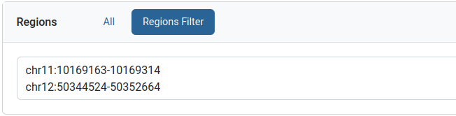

The user can also filter by phenotypic measures through the "Advanced" tab.
A measure is selected and the user is provided with a histogram, similar to
the `Gene scores`_ filter.

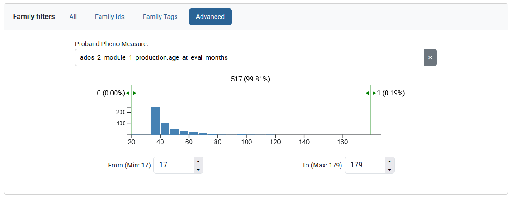

Study filters
#############

This filter can be found on genotype data groups and allows selecting a
subset of its studies.

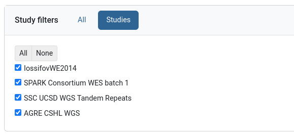

Genomic scores filters
######################

This filter allows the user to limit his query to a range of values for a
given genomic score, similar to the `Gene scores`_ filter.
The user can filter by multiple genomic scores.
This filter is dependent on variant annotation during genotype data import.

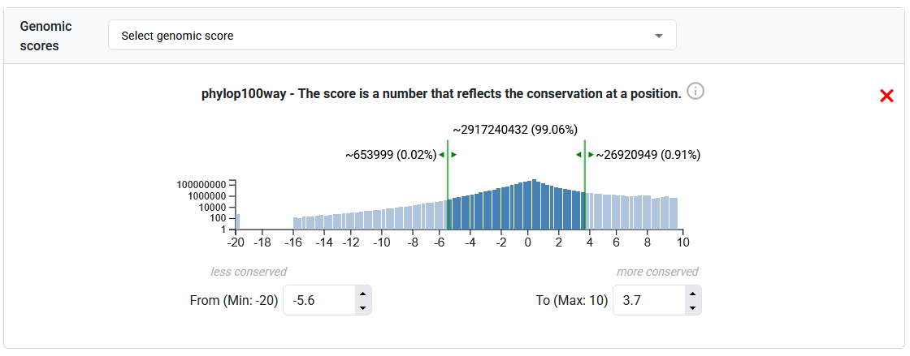

Family and person filters
#########################

These two filters have identical interfaces, but work on families or
individuals respectively. Specific families or individuals can be queried
for using the "IDs" tab. IDs can be listed as comma or newline separated
values.

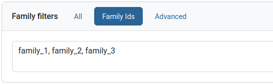

Unique family variants
######################

This toggles how identical family variants from different studies are shown.

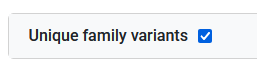

.. include:: user_management.rst
