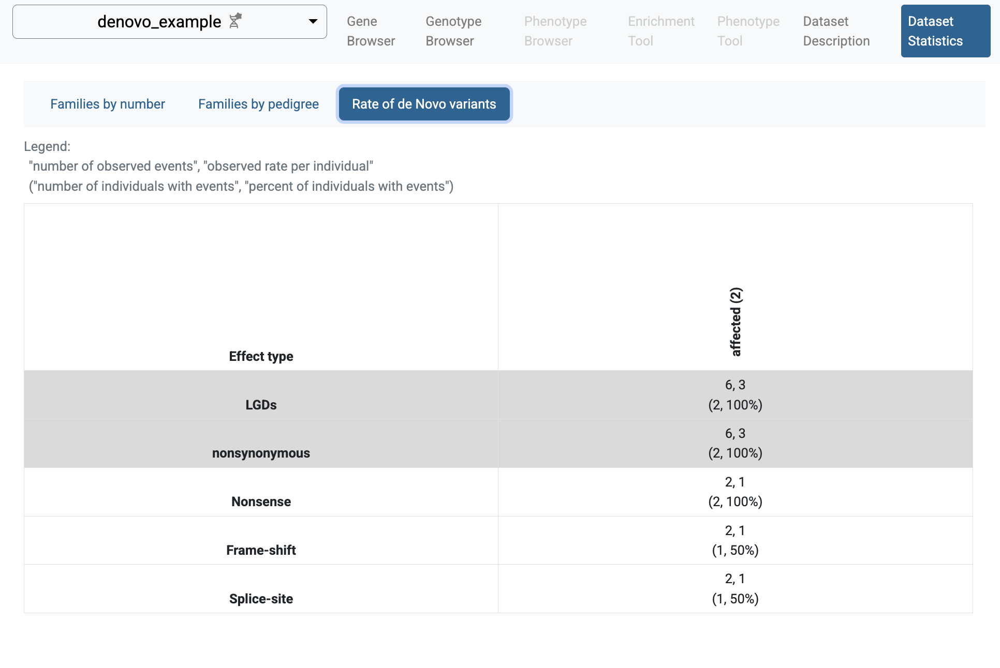
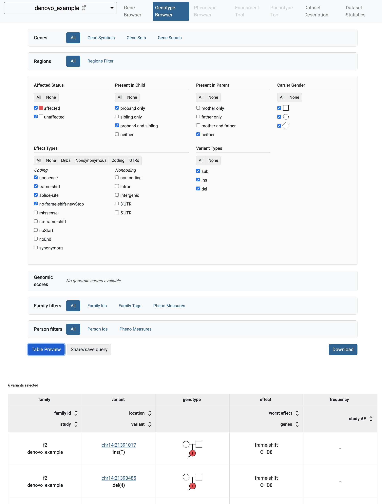
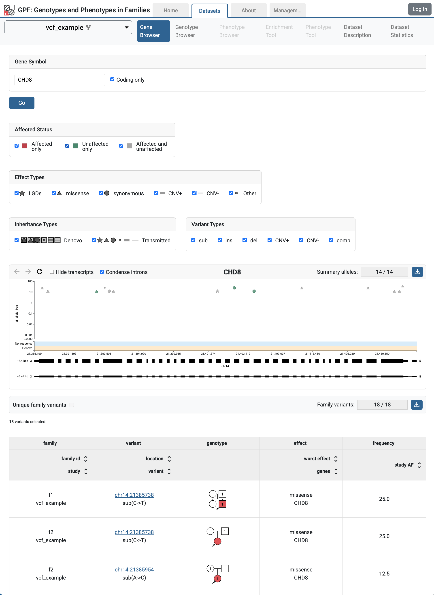
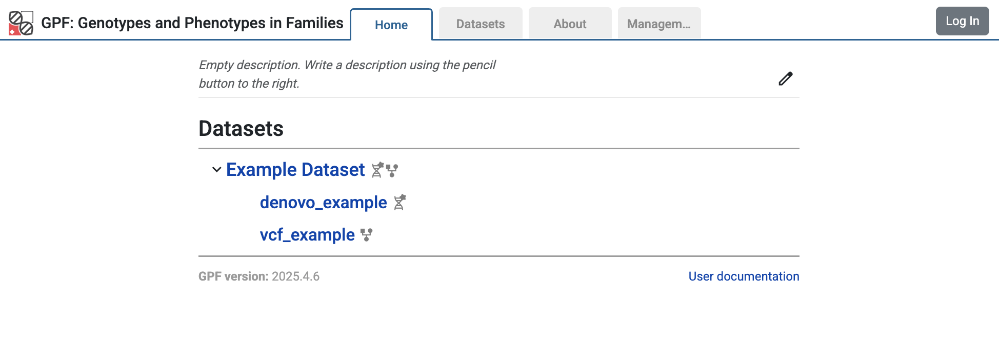

GPF Getting Started Guide
=========================

Setup
#####

Prerequisites
+++++++++++++

This guide assumes that you are working on a recent Linux (or Mac OS X) machine.

The GPF system is distributed as a Conda package. You must install a distribution
of Conda or Mamba package manager if you do not have a working version 
of Anaconda, Miniconda, or Mamba. We recommended using a Miniforge distribution.

Go to the `Miniforge home page <https://github.com/conda-forge/miniforge>`_
and follow the instructions for your platform.

.. warning::

    The GPF system is not supported on Windows.

GPF Installation
++++++++++++++++

The GPF system is developed in Python and supports Python 3.11 and up.
The recommended way to set up a conda GPF environment.

Create an empty Conda environment named `gpf`:

.. code-block:: bash

    mamba create -n gpf

To use this environment, you need to activate it using the following command:

.. code-block:: bash

    mamba activate gpf

Install the `gpf_wdae` conda package into the already activated `gpf`
environment:

.. code-block:: bash

    mamba install \
        -c conda-forge \
        -c bioconda \
        -c iossifovlab \
        -c defaults \
        gpf_wdae

This command is going to install GPF and all of its dependencies.

Getting the demonstration data
++++++++++++++++++++++++++++++

.. code-block:: bash

    git clone https://github.com/iossifovlab/gpf-getting-started.git

Navigate to the newly created directory:

.. code-block:: bash

    cd gpf-getting-started

This repository provides a minimal GPF instance configuration and
sample data to be imported.

Starting and stopping the GPF web interface
+++++++++++++++++++++++++++++++++++++++++++

By default, the GPF system looks for a file ``gpf_instance.yaml`` in the
current directory (and its parent directories). If GPF finds such a file, it
uses it as a configuration for the GPF instance. Otherwise,
GPF will look for the ``DAE_DB_DIR`` environment variable. If it is not set,
it throws an exception.

For this manual, we recommend setting the ``DAE_DB_DIR`` environment variable.

From within the ``gpf-getting-started`` directory, run the following command:

.. code-block:: bash

    export DAE_DB_DIR=$(pwd)/minimal_instance

For this guide, we use a ``gpf_instance.yaml`` file that is already provided
in the ``minimal_instance`` subdirectory:

.. literalinclude:: gpf-getting-started/minimal_instance/gpf_instance.yaml

GPF instance configuration requires a reference genome and gene models to
annotate variants with effects on genes.

If not specified otherwise, GPF uses the GPF Genomic Resources
Repository (GRR) located at
`https://grr.iossifovlab.com/ <https://grr.iossifovlab.com/>`_
to find the resources it needs.

For this guide, we use the HG38 reference genome (``hg38/genomes/GRCh38-hg38``)
and MANE 1.3 gene models (``hg38/gene_models/MANE/1.3``) provided in the default
GRR.

.. note::

    For more on GPF instance configuration, see :doc:`gpf_instance_configuration`.

Now we can run the GPF development web server and browse our empty GPF
instance:

.. code-block:: bash

    wgpf run

and browse the GPF development server at ``http://localhost:8000``.

The web interface will be mostly empty, as at this point, there is no data
imported into the instance.

To stop the development GPF web server, you should press ``Ctrl-C`` - the usual
keybinding for stopping long-running commands in a terminal.

.. warning::

    The development web server, run by ``wgpf run`` used in this guide, is meant 
    for development purposes only and is not suitable for serving the GPF 
    system in production.

Importing genotype data
#######################

Import Tools and Import Project
+++++++++++++++++++++++++++++++

The tool used to import genotype data is named ``import_genotypes``. This tool
expects an import project file that describes the import.

We support importing variants from multiple formats.

For this demonstration, we will be importing from the following formats:

* List of de novo variants
* Variant Call Format (`VCF <https://samtools.github.io/hts-specs/VCFv4.3.pdf>`_)

Example import of de novo variants
++++++++++++++++++++++++++++++++++

Let us import a small list of de novo variants.

.. note::

    All the data files needed for this example are available in the
    `gpf-getting-started <https://github.com/iossifovlab/gpf-getting-started.git>`_
    repository under the subdirectory ``input_genotype_data``.

A pedigree file that describes the families is needed -
``input_genotype_data/example.ped``:

.. literalinclude:: gpf-getting-started/input_genotype_data/example.ped
    :tab-width: 10

We will also need the list of de novo variants
``input_genotype_data/example.tsv``:

.. literalinclude:: gpf-getting-started/input_genotype_data/example.tsv
    :tab-width: 10

A project configuration file for importing this study -
``input_genotype_data/denovo_example.yaml`` - is also provided:

.. literalinclude:: gpf-getting-started/input_genotype_data/denovo_example.yaml

To import this project, run the following command:

.. code-block:: bash

    import_genotypes input_genotype_data/denovo_example.yaml

.. note::

    For more information on the import project configuration file,
    see :doc:`import_tool`.

    For more information on working with pedigree files,
    see :doc:`working_with_pedigree_files`.

The import genotypes tool will read all the variants from the files,
specified in the project configuration will annotate them using the reference genome and
gene models specified in the GPF instance configuration, and will store them
in an appropriate format for use by the GPF system. By default, the imported
files are stored in the ``internal_storage`` subdirectory of the GPF instance
directory. 

It will also create
a minimal study configuration file for the imported study, located in
``minimal_instance/studies/denovo_example.yaml``.

There are also some additional intermediary files created in the import project
directory ``input_genotype_data/denovo_example``. 

When the import finishes, you can run the GPF development server using:

.. code-block:: bash

    wgpf run

and browse the content of the GPF development server at
``http://localhost:8000``

The home page of the GPF system will show the imported study
``denovo_example``.

If you follow the link to the study and choose the `Dataset Statistics`
page, you
will see some summary information for the imported study: families and
individuals included in the study, types of families, and rates of de novo
variants.

.. figure:: getting_started_files/denovo-example-dataset-statistics.png

    Statistics of individuals by affected status and sex

.. figure:: getting_started_files/denovo-example-families-by-pedigree.png

    Statistics of families by family type

    Rate of de novo variants

If you select the `Genotype Browser` page, you will be able to see the imported
de novo variants. The default filters search for LGD de novo
variants. It happens that all de novo variants imported in the
`denovo_example` study are LGD variants.

So, when you click the `Table Preview` button, all the imported variants
will be shown.

    Genotype Browser with de novo variants

Example import of VCF variants
++++++++++++++++++++++++++++++

Similar to the sample denovo variants, there are also sample variants in
VCF format. They can be found in ``input_genotype_data/example.vcf``;
the same pedigree file from before is used.

.. literalinclude:: gpf-getting-started/input_genotype_data/example.vcf
    :tab-width: 10

A project configuration file is provided -
``input_genotype_data/vcf_example.yaml``.

.. literalinclude:: gpf-getting-started/input_genotype_data/vcf_example.yaml

To import them, run the following command:

.. code-block:: bash

    import_genotypes input_genotype_data/vcf_example.yaml

When the import finishes, you can run the GPF development server using:

.. code-block:: bash

    wgpf run

and browse the content of the GPF development server at
``http://localhost:8000``

The GRF instance `Home Page` now includes the imported study ``vcf_example``.

If you follow the link to the `vcf_example`, you will get to
the `Gene Browser` page for the study.
It happens that all imported VCF variants are located on the CHD8 gene.
Fill `CHD8` in the `Gene Symbol` box and click the `Go` button.

    `Gene Browser`` for CHD8 gene shows variants from ``vcf_example`` study

In `Gene Browser` results, the top section has the summary variants, which show
the location and frequency of the variants, the bottom section has the
family variants, which show the family information, pedigree, and additional
annotations.

The user may also observe these variants in the genotype browser by
choosing:

* 'All' in `Present in Child`
* 'All' in `Present in Parent` and 'all' in `Rarity`
* 'All' in `Effect Types`.

Example of a dataset (group of genotype studies)
++++++++++++++++++++++++++++++++++++++++++++++++

The already imported studies ``denovo_example`` and ``vcf_example``
have genomic variants for the same group of individuals ``example.ped``.
We can create a dataset (group of genotype studies) that includes both studies.

To this end, create a directory ``datasets/example_dataset`` inside the GPF
instance directory ``minimal_instance``:

.. code-block:: bash

    mkdir -p minimal_instance/datasets/example_dataset

and create the following configuration file ``example_dataset.yaml`` inside
that directory:

.. code-block:: yaml

    id: example_dataset
    name: Example Dataset

    studies:
      - denovo_example
      - vcf_example

When the configuration is ready, restart the ``wgpf`` command. The home page
of the GPF instance will change and now will include the configured dataset
``example_dataset``.

    Home page of the GPF instance showing the `example_dataset`

Follow the link to the `Example Dataset`, choose the `Gene Browser` page,
and fill in `CHD8` in the `Gene Symbol`. Click the `Go` button, and now you
will be able to see the variants from both studies.

.. figure:: getting_started_files/example-dataset-gene-browser.png

    Gene Browser for CHD8 gene shows variants from both studies -
    ``denovo_example`` and ``vcf_example``

.. include:: getting_started/getting_started_with_annotation.rst

.. .. include:: getting_started/getting_started_with_gene_browser.rst

.. include:: getting_started/getting_started_with_phenotype_data.rst

.. include:: getting_started/getting_started_with_preview_columns.rst

.. include:: getting_started/example_denovo_import.rst

.. include:: getting_started/example_cnv_import.rst

.. include:: getting_started/getting_started_with_gene_sets.rst

.. include:: getting_started/getting_started_with_enrichment.rst

.. include:: getting_started/getting_started_with_python_interface.rst
