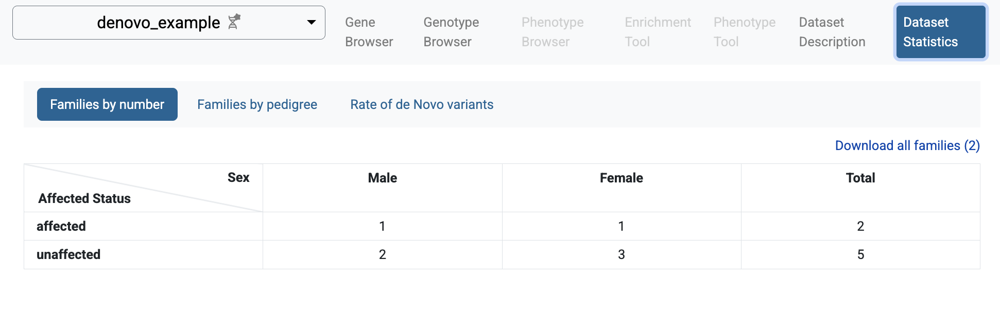
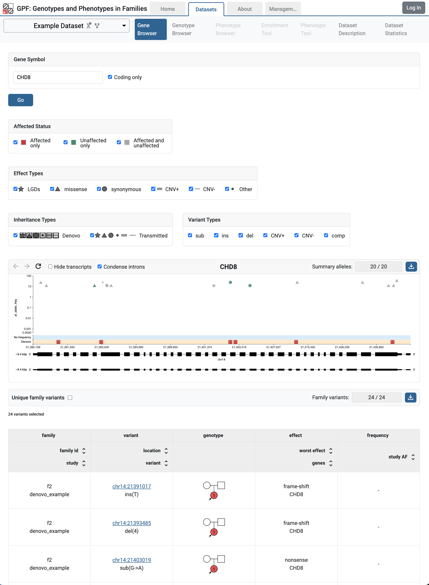

GPF Getting Started Guide
=========================

Setup
#####

Prerequisites
+++++++++++++

This guide assumes that you are working on a recent Linux box.

The GPF system is distributed as an Anaconda package using the ``conda``
package manager.

If you do not have a working version of Anaconda or Miniconda, you must
install one. We recommended using a Miniconda version.

Go to the Miniconda 
`distribution page <https://docs.conda.io/en/latest/miniconda.html>`_,
download the Linux installer

.. code-block:: bash

    wget -c https://repo.anaconda.com/miniconda/Miniconda3-latest-Linux-x86_64.sh

and install it in your local environment:

.. code-block:: bash

    sh Miniconda3-latest-Linux-x86_64.sh

.. note::

    At the end of the installation process, you will be asked if you wish
    to allow the installer to initialize Miniconda3 by running `conda` init.
    If you choose to, every terminal you open after that will have the ``base``
    Anaconda environment activated, and you'll have access to the ``conda``
    commands used below.

Once Anaconda/Miniconda is installed, we would recommend installing ``mamba`` 
instead of ``conda``. Mamba will speed up the installation of packages:

.. code-block::

    conda install -c conda-forge mamba

GPF Installation
++++++++++++++++

The GPF system is developed in Python and supports Python 3.9 and up.
The recommended way to set up the GPF development environment is to use Anaconda.

Create an empty Anaconda environment named `gpf`:

.. code-block:: bash

    conda create -n gpf

To use this environment, you need to activate it using the following command:

.. code-block:: bash

    conda activate gpf

Install the `gpf_wdae` conda package into the already activated `gpf`
environment:

.. code-block:: bash

    mamba install \
        -c conda-forge \
        -c bioconda \
        -c iossifovlab \
        -c defaults \
        gpf_wdae

This command is going to install GPF and all of its dependencies.

Getting the demonstration data
++++++++++++++++++++++++++++++

.. code-block:: bash

    git clone https://github.com/iossifovlab/gpf-getting-started.git

Navigate to the newly-created directory:

.. code-block:: bash

    cd gpf-getting-started

This repository provides a minimal instance and sample data to be imported.

The reference genome used by this GPF instance is ``hg38/genomes/GRCh38-hg38`` 
from the default GRR.
The gene models used by this GPF instance are ``hg38/gene_models/refSeq_v20200330`` 
from the default GRR.
If not specified otherwise, GPF uses the default genomic resources
repository located at `https://grr.iossifovlab.com/ <https://grr.iossifovlab.com/>`_.
Resources are used without caching.

Starting and stopping the GPF web interface
+++++++++++++++++++++++++++++++++++++++++++

By default, the GPF system looks for a file ``gpf_instance.yaml`` in the
current directory (and its parent directories). If GPF finds such a file, it
uses it as a configuration for the GPF instance. Otherwise, it throws an
exception.

Additionally, GPF will also consider the ``DAE_DB_DIR`` environment variable.
You can set it using the following command:

.. code-block:: bash

    export DAE_DB_DIR=$(pwd)/minimal_instance

For this guide we use a ``gpf_instance.yaml`` file that is already provided in the
``minimal_instance`` subdirectory:

.. literalinclude:: gpf-getting-started/minimal_instance/gpf_instance.yaml

GPF instance configuration requires a reference genome and gene models to 
annotate variants with effects on genes. 
For this giude we use HG38 reference genome and MANE 1.4 gene models.

.. note::

    For more on GPF instance configuration see :doc:`gpf_instance_configuration`.

Now we can run the GPF development web server and browse our empty GPF instance:

.. code-block:: bash

    wgpf run

and browse the GPF development server at ``http://localhost:8000``.

The web interface will be mostly empty, as at this point there is no data imported
into the instance.

To stop the development GPF web server, you should press ``Ctrl-C`` - the usual
keybinding for stopping long-running Linux commands in a terminal.

.. warning::

    The development web server run by ``wgpf run`` used in this guide
    is meant for development purposes only
    and is not suitable for serving the GPF system in production.

Importing genotype data
#######################

Import Tools and Import Project
+++++++++++++++++++++++++++++++

Importing genotype data into a GPF instance involves multiple steps. 
The tool used to import genotype data is named ``import_genotypes``. This tool
expects an import project file that describes the import.

We support importing variants from multiple formats.

For this demonstration, we will be importing from the following formats:

* List of de novo variants
* Variant Call Format (`VCF <https://samtools.github.io/hts-specs/VCFv4.3.pdf>`_)

Example import of de novo variants
++++++++++++++++++++++++++++++++++

Let us import a small list of de novo variants.

A pedigree file that describes the families is needed - 
``input_genotype_data/example.ped``:

.. literalinclude:: gpf-getting-started/input_genotype_data/example.ped
    :tab-width: 10

We will also need the list of de novo variants ``input_genotype_data/example.tsv``:

.. literalinclude:: gpf-getting-started/input_genotype_data/example.tsv
    :tab-width: 10

A project configuration file for importing this study - 
``input_genotype_data/denovo_example.yaml`` - is also provided:

.. literalinclude:: gpf-getting-started/input_genotype_data/denovo_example.yaml

To import this project run the following command:

.. code-block:: bash

    import_genotypes input_genotype_data/denovo_example.yaml

.. note::

    For more information on the import project file, see :doc:`import_tool`.

    For more information on workgin with pedigree files, see :doc:`working_with_pedigree_files`.

When the import finishes you can run the GPF development server using:

.. code-block:: bash

    wgpf run

and browse the content of the GPF development server at ``http://localhost:8000``

The home page of the GPF system will show the imported study ``denovo_example``.

.. image:: getting_started_files/denovo-example-home-page.png

If you follow the link to the study, and choose `Dataset Statistics` page, you 
will see some summary information for the imported study: families and individuals
included in the study, types of families and rates of de novo variants.

    Statistics of individuals by affected status and sex

.. figure:: getting_started_files/denovo-example-families-by-pedigree.png

    Statistics of families by family type

.. figure:: getting_started_files/denovo-example-rate-de-novo-variants.png

    Rate of de novo variants

If you select `Genotype Browser` page, you will be able to see the imported
de novo variants in the browser. The default filters search for LGD de novo
variants. It happens, that all de novo variants imported in the `denovo_example`
study are LGD variants. So, if you click `Preview` button all the imported variants 
will be shown.

.. figure:: getting_started_files/denovo-example-genotype-browser.png

    Genotype Browser with de novo variants

Example import of VCF variants
++++++++++++++++++++++++++++++

Similar to the sample denovo variants, there are also sample variants in VCF format.
They can be found in ``input_genotype_data/example.vcf`` and the same pedigree file from before is used.

.. literalinclude:: gpf-getting-started/input_genotype_data/example.vcf
    :tab-width: 10

A project configuration file is again provided - ``input_genotype_data/vcf_example.yaml``.

.. literalinclude:: gpf-getting-started/input_genotype_data/vcf_example.yaml

To import them, run the following command:

.. code-block:: bash

    import_genotypes input_genotype_data/vcf_example.yaml

When the import finishes you can run the GPF development server using:

.. code-block:: bash

    wgpf run

and browse the content of the GPF development server at ``http://localhost:8000``

The GRF instance `Home Page` now includes the imported study ``vcf_example``.

.. image:: getting_started_files/vcf-example-home-page.png

It happens that all imported VCF variants are located on CHD8 gene. To browse 
these variants 
follow the link to the `vcf_example` study, and choose `Gene Browser`
page. Fill `CHD8` in the `Gene Symbol` box and click `Go` button.

.. figure:: getting_started_files/vcf-example-gene-browser.png

    Gene Browser for CHD8 gene shows variants from ``vcf_example`` study

Example of a dataset (group of genotype studies)
++++++++++++++++++++++++++++++++++++++++++++++++

The already imported studies ``denovo_example`` and ``vcf_example``
have genomic variants for the same group of individuals ``example.ped``.
We can create a dataset (group of genotype studies) that include both studies.

To this end create a directory ``datasets/example_dataset`` inside the GPF instance
directory ``minimal_instance``:

.. code-block:: bash

    mkdir -p minimal_instance/datasets/example_dataset

and place the following configuration file ``example_dataset.yaml`` inside that directory:

.. code-block:: yaml

    id: example_dataset
    name: Example Dataset
    
    studies:
      - denovo_example
      - vcf_example    

When ready with the configuration restart the ``wgpf`` command. The home page of
the GPF instance will change and now will include the configured dataset ``example_dataset``.

.. image:: getting_started_files/example-dataset-home-page.png

Follow the link to `Example Dataset`, choose the `Gene Browser` page 
and fill `CHD8` in the `Gene Symbol`. Click `Go` button and now you will be
able to see the variants from both studies.

    Gene Browser for CHD8 gene shows variants from both studies - 
    ``denovo_example`` and ``vcf_example``

.. Getting started with de novo gene sets
.. ######################################

.. To generate de novo gene sets, you can use the ``generate_denovo_gene_sets`` tool.

.. By default the de novo gene sets are disabled. If you want to enable them for a 
.. specific study or dataset you need to update its configuration and add a section
.. that enables the de novo gene sets:

.. .. code-block:: yaml

..     denovo_gene_sets:
..       enabled: true

.. For example the configuration of ``example_dataset`` dataset should become similar to:

.. .. code-block:: yaml

..     id: example_dataset
..     name: Example Dataset
    
..     studies:
..       - denovo_example
..       - vcf_example
    
..     common_report:
..       enabled: True
    
..     denovo_gene_sets:
..       enabled: true
    

.. Then we can generate the de novo gene sets for ``example_dataset`` dataset by
.. running:

.. .. code-block:: bash

..     generate_denovo_gene_sets --studies example_dataset

.. include:: getting_started/getting_started_with_annotation.rst

.. include:: getting_started/getting_started_with_preview_columns.rst

.. .. include:: getting_started/getting_started_with_gene_browser.rst

.. include:: getting_started/getting_started_with_phenotype_data.rst

.. include:: getting_started/getting_started_with_python_interface.rst

.. include:: getting_started/example_denovo_import.rst
