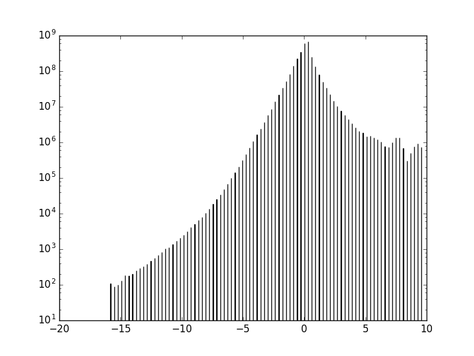
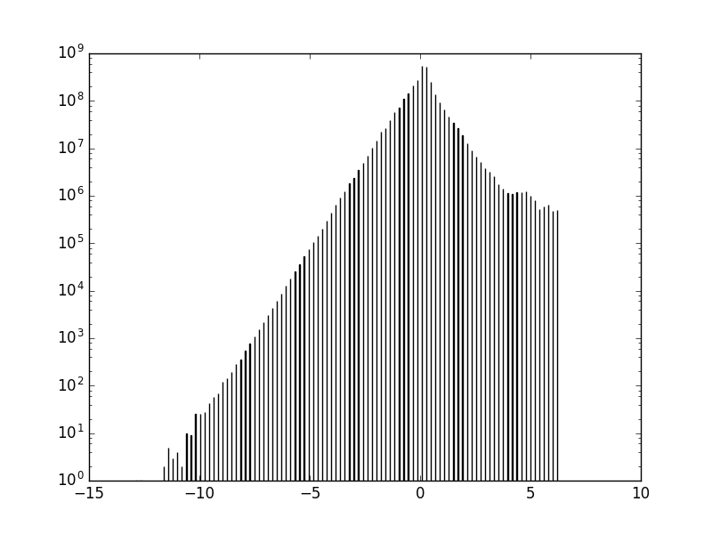
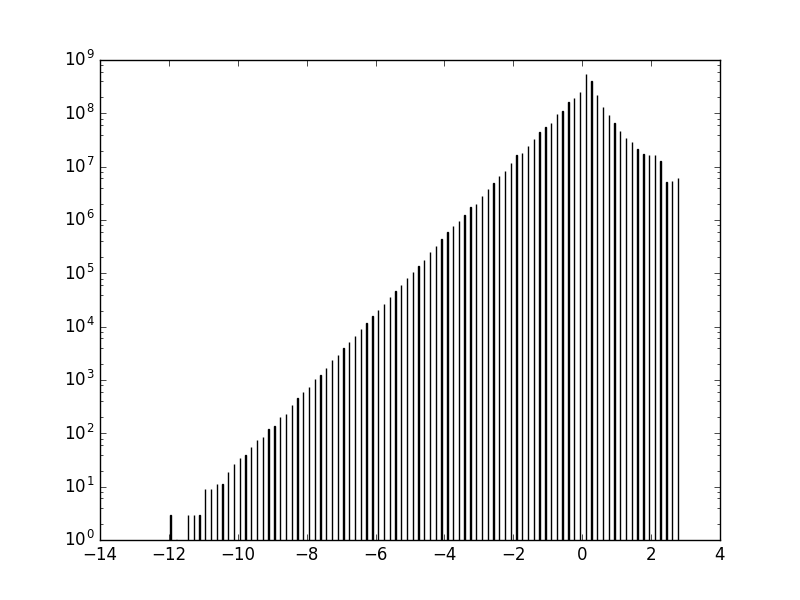
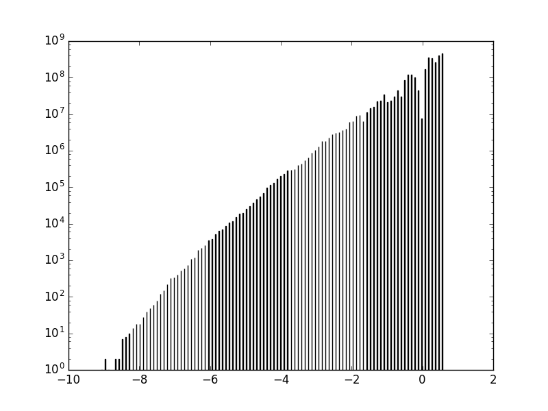
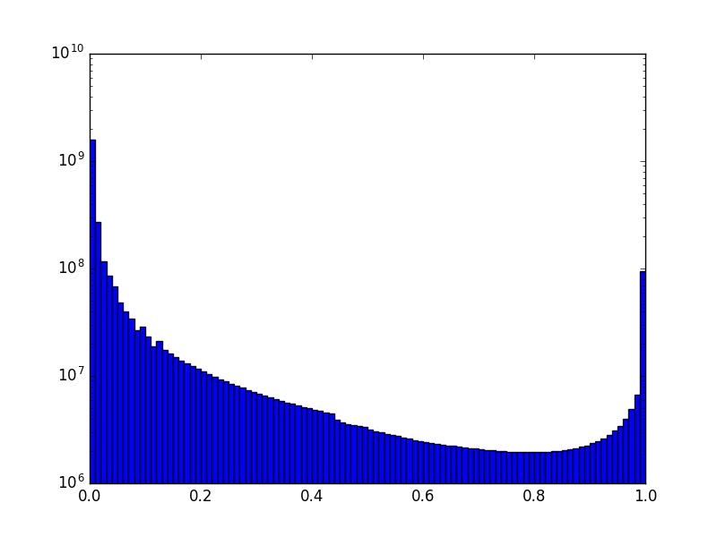
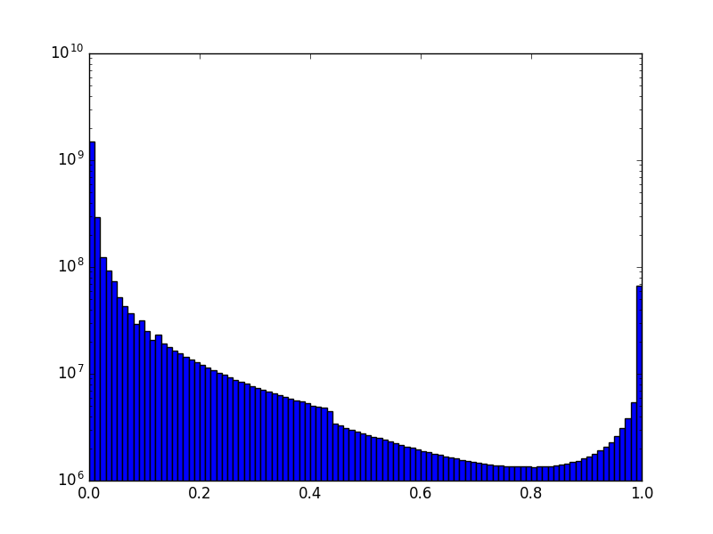
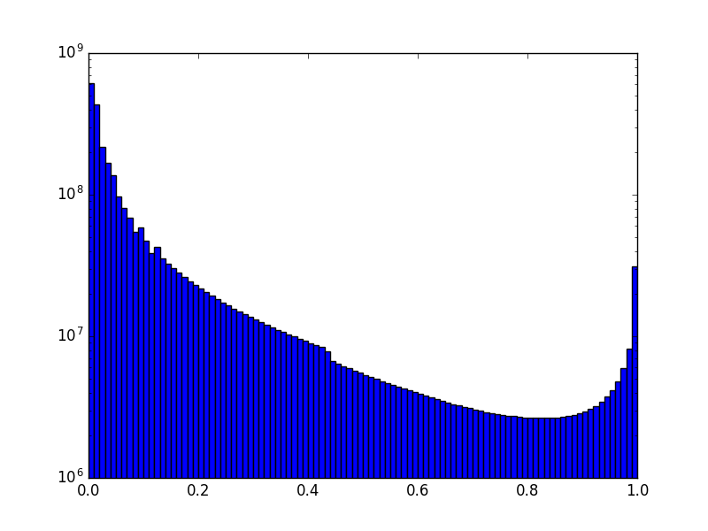

GPF Genotype Browser Columns
============================

Preview columns
---------------

========  ========  ===========
Column    Field     Description
========  ========  ===========
family    familyId  .. image:: imgs/genomic_scores/phyloP100.png
                       
\         study    
variant   vocation
\         variant
========  ========  ===========

Download columns
----------------

Genomic Scores
----------------

family id
.........

study
.....

phenotype
.........

location
........

variant
........

family genotype
...............

family structure
................

from parent
...........

in child
........

count
.....

alt alleles
...........

parents called
..............

worst effect type
.................

genes
.....

all effects
...........

effect details
..............

LGD rank
........

RVIS rank
.........

pLI rank
........

phyloP100
.........

Link: http://hgdownload.cse.ucsc.edu/goldenpath/hg19/phyloP100way/.
Conservation scoring by phyloP (phylogenetic p-values) from the
PHAST package (http://compgen.bscb.cornell.edu/phast/) for multiple
alignments of 99 vertebrate genomes to the human genome.

   phyloP100

phyloP46_vertebrates
....................

Link: http://hgdownload.cse.ucsc.edu/goldenpath/hg19/phyloP46way/.
Conservation scoring by phyloP (phylogenetic p-values) from the
PHAST package (http://compgen.bscb.cornell.edu/phast/) for multiple
alignments of 45 vertebrate genomes to the human genome, plus alternate
sets of scores for the primate species and the placental mammal species
in the alignments.

   phyloP46_vertebrates

phyloP46_placentals
...................

Alternate set of phyloP46_vertebrates scores for the placental mammal
subset of species in the alignments.

   phyloP46_placentals

phyloP46_primates
.................

Alternate set of phyloP46_vertebrates scores for the primates subset species
in the alignments.

   phyloP46_primates

phastCons100
............

Link: http://hgdownload.cse.ucsc.edu/goldenpath/hg19/phastCons100way/.
Compressed phastCons scores for multiple alignments of 99 vertebrate
genomes to the human genome. PhastCons is a program for identifying
evolutionarily conserved elements in a multiple alignment, given a
phylogenetic tree.

   phastCons100

phastCons46_vertebrates
.......................

Link: http://hgdownload.cse.ucsc.edu/goldenpath/hg19/phastCons46way/.
Compressed phastCons scores for multiple alignments of 45 vertebrate genomes
to the human genome, plus an alternate set of scores for the primates subset
of species in the alignments, and an alternate set of scores for the placental
mammal subset of species in the alignments. PhastCons is a program for
identifying evolutionarily conserved elements in a multiple alignment,
given a phylogenetic tree.

   phastCons46_vertebrates

phastCons46_placentals
......................

Alternate set of phastCons46_vertebrates scores for the placental mammal subset
of species in the alignments.

   phastCons46_placentals

phastCons46_primates
....................

Alternate set of phastCons46_vertebrates scores for the primates subset of
species in the alignments.

   phastCons46_primates

CADD_raw
........

Link: https://cadd.gs.washington.edu/download ; Higher values of raw
scores have relative meaning that a variant is more likely to be simulated
(or "not observed") and therefore more likely to have deleterious effects.
Scaled scores are PHRED-like (-10*log10(rank/total)) scaled C-score ranking
a variant relative to all possible substitutions of the
human genome (8.6x10^9).

.. figure:: imgs/genomic_scores/CADD_raw_gs.png
   :scale: 50
   :alt: CADD raw
   :align: center

   CADD raw

CADD_phred
..........

Link: https://cadd.gs.washington.edu/download ; Higher values of raw scores
have relative meaning that a variant is more likely to be simulated
(or "not observed") and therefore more likely to have deleterious effects.
Scaled scores are PHRED-like (-10*log10(rank/total)) scaled C-score ranking
a variant relative to all possible substitutions of the
human genome (8.6x10^9).

.. figure:: imgs/genomic_scores/CADD_phred_gs.png
   :scale: 50
   :alt: CADD phred
   :align: center

   CADD phred

Linsight
........

Linsight scores for prediction of deleterious noncoding variants

.. figure:: imgs/genomic_scores/Linsight.png
   :scale: 50
   :alt: Linsight
   :align: center

   Linsight

FitCons i6 merged
.................

Link: http://compgen.cshl.edu/fitCons/0downloads/tracks/i6/scores/.
Indicates the fraction of genomic positions evincing a particular pattern
(or "fingerprint") of functional assay results, that are under selective
pressure. Score ranges from 0.0 to 1.0. A lower score indicates higher
confidence.

.. figure:: imgs/genomic_scores/FitCons-i6-merged.png
   :scale: 50
   :alt: FitCons-i6-merged
   :align: center

   FitCons i6 merged

FitCons2 Brain Angular Gyrus
............................

Scores for E067-Brain Angular Gyrus score-Roadmap Epigenomics DHS regions

.. figure:: imgs/genomic_scores/FitCons2_E067.png
   :scale: 50
   :alt: FitCons2 E067-Brain Angular Gyrus
   :align: center

   FitCons2 E067-Brain Angular Gyrus

FitCons2 Brain Anterior Caudate
...............................

Scores for E068-Brain Anterior Caudate score-Roadmap Epigenomics DHS regions

.. figure:: imgs/genomic_scores/FitCons2_E068.png
   :scale: 50
   :alt: FitCons2 E068-Brain Anterior Caudate
   :align: center

   FitCons2 E068-Brain Anterior Caudate

FitCons2 Brain Cingulate Gyrus
..............................

Scores for E069-Brain Cingulate Gyrus score-Roadmap Epigenomics DHS regions

.. figure:: imgs/genomic_scores/FitCons2_E069.png
   :scale: 50
   :alt: FitCons2 E069-Brain Cingulate Gyrus
   :align: center

   FitCons2 E069-Brain Cingulate Gyrus

FitCons2 Brain Germinal Matrix
..............................

Scores for E070-Brain Germinal Matrix score-Roadmap Epigenomics DHS regions

.. figure:: imgs/genomic_scores/FitCons2_E070.png
   :scale: 50
   :alt: FitCons2 E070-Brain Germinal Matrix
   :align: center

   FitCons2 E070-Brain Germinal Matrix

FitCons2 Brain Hippocampus Middle
.................................

Scores for E071-Brain Hippocampus Middle score-Roadmap Epigenomics DHS regions

.. figure:: imgs/genomic_scores/FitCons2_E071.png
   :scale: 50
   :alt: FitCons2 E071-Brain Hippocampus Middle
   :align: center

   FitCons2 E071-Brain Hippocampus Middle

FitCons2 Brain Inferior Temporal Lobe
.....................................

Scores for E072-Brain Inferior Temporal Lobe score-Roadmap Epigenomics
DHS regions

.. figure:: imgs/genomic_scores/FitCons2_E072.png
   :scale: 50
   :alt: FitCons2 E072-Brain Inferior Temporal Lobe
   :align: center

   FitCons2 E072-Brain Inferior Temporal Lobe

FitCons2 Brain Dorsolateral Prefrontal Cortex
.............................................

Scores for E073-Brain Dorsolateral Prefrontal Cortex score-Roadmap Epigenomics
DHS regions

.. figure:: imgs/genomic_scores/FitCons2_E073.png
   :scale: 50
   :alt: FitCons2 E073-Brain Dorsolateral Prefrontal Cortex
   :align: center

   FitCons2 E073-Brain Dorsolateral Prefrontal Cortex

FitCons2 Brain Substantia Nigra
...............................

Scores for E074-Brain Substantia Nigra score-Roadmap Epigenomics DHS regions

.. figure:: imgs/genomic_scores/FitCons2_E074.png
   :scale: 50
   :alt: FitCons2 E074-Brain Substantia Nigra
   :align: center

   FitCons2 E074-Brain Substantia Nigra

FitCons2 Fetal Brain Male
.........................

Scores for E081-Fetal Brain Male score-Roadmap Epigenomics DHS regions

.. figure:: imgs/genomic_scores/FitCons2_E081.png
   :scale: 50
   :alt: FitCons2 E081-Fetal Brain Male
   :align: center

   FitCons2 E081-Fetal Brain Male

FitCons2 Fetal Brain Female
...........................

Scores for E082-Fetal Brain Female score-Roadmap Epigenomics DHS regions

.. figure:: imgs/genomic_scores/FitCons2_E082.png
   :scale: 50
   :alt: FitCons2 E082-Fetal Brain Female
   :align: center

   FitCons2 E082-Fetal Brain Female

SSC-freq
........

genome_gnomAD-AC
................

genome_gnomAD-AN
................

genome_gnomAD-AF
................

genome_gnomAD-controls_AC
.........................

genome_gnomAD-controls_AN
.........................

genome_gnomAD-controls_AF
.........................

exome_gnomAD-AC
...............

exome_gnomAD-AN
...............

exome_gnomAD-AF
...............

exome_gnomAD-controls_AC
........................

exome_gnomAD-controls_AN
........................

exome_gnomAD-controls_AF
........................

