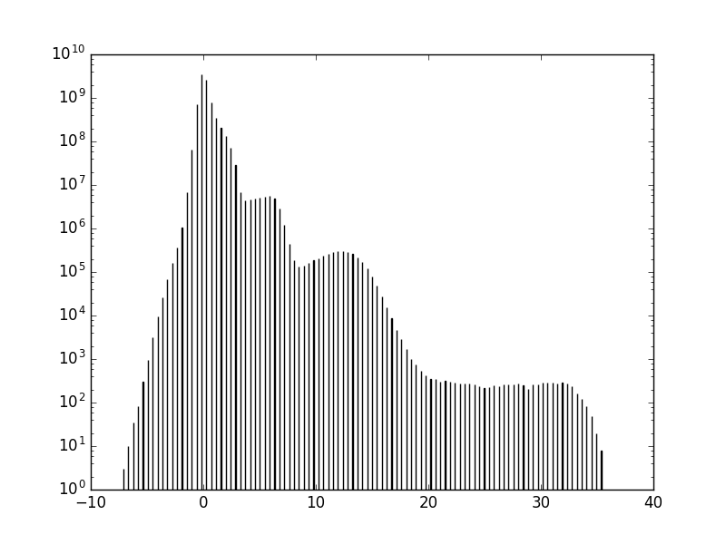
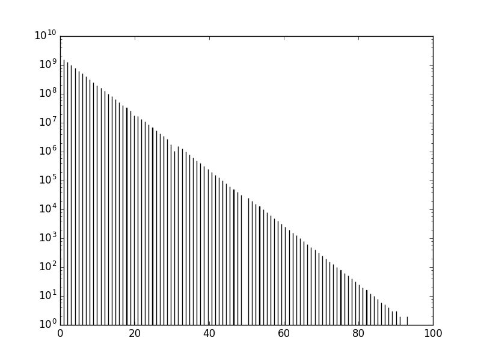
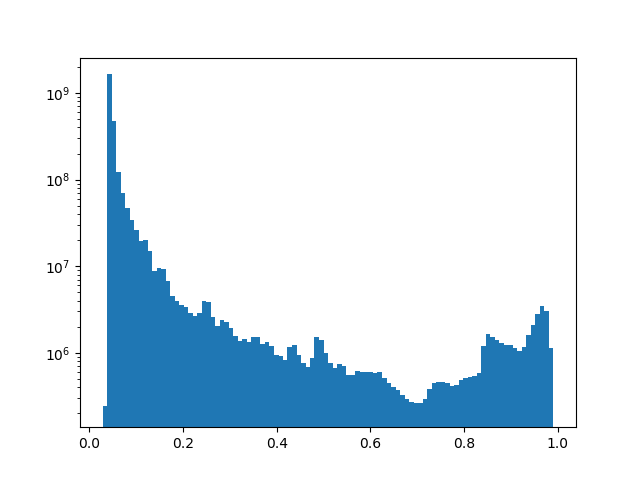
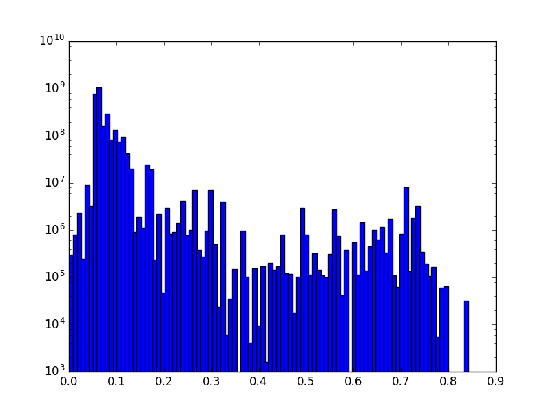
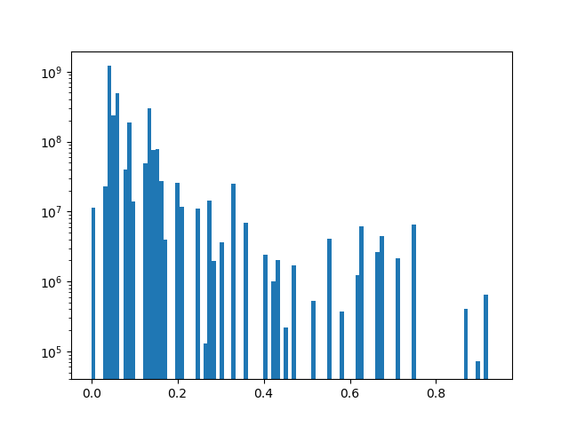
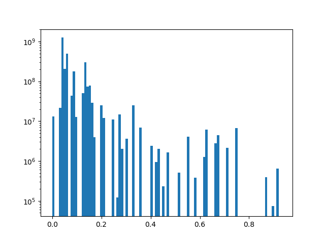
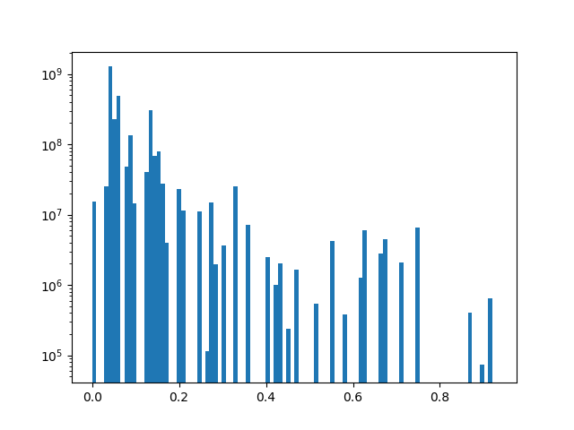
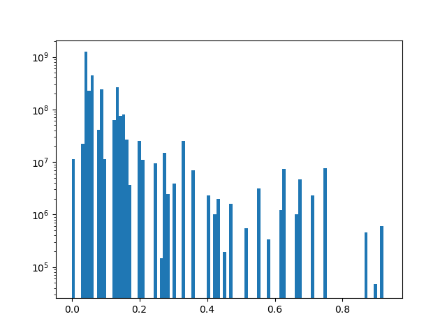

GPF Genotype Browser Columns
============================

Preview columns
---------------

========  ========  ===========
Column    Field     Description
========  ========  ===========
family    familyId  Family	ID	
\         study     Study name
variant   location  The	position of	the variant in a 1-­‐based coordinate
                    system of hg19 reference assembly.
\         variant   Description of the variant: sub(R-­‐>A) stands for 
                    substitution of the reference allele R to an alternative 
                    allele A; ins(seq) stands for insertion of the provided 
                    sequence (“seq”), and del(N) stands for deletions of 
                    N nucleotides
========  ========  ===========

Download columns
----------------

=================== ===========================================================
Field               Description
=================== ===========================================================
familyId            Family ID

study               Study name

phenotype           Study phenotype

location            The position of the variant in a 1-­‐based coordinate
                    system of hg19 reference assembly.

variant             Description of the variant: sub(R-­‐>A) stands for
                    substitution of the reference allele R to an alternative
                    allele A; ins(seq) stands for insertion of the provided
                    sequence (“seq”), and del(N) stands for deletions of
                    N nucleotides

family genotype     The best state according to the Multinomial Model
                    (Experimental Procedures). The format of the column is
                    "momR dadR autR sibR/momA dadA autA sibA" where
                    (for example) momR stands for the number of copies of the
                    reference allele in the mother’s genotype and autA stands
                    for the number of
                    copies of the alternative allele in the genotype of the
                    affected child.

family structure

from parent         Shows the parental haplotypes giving rise to de novo
                    variants
                    when they could be identified.

in child            Shows the affected status and gender of the child in
                    which the
                    de novo variant was observed. The two children are listed
                    when
                    the de novo variant is shared by both.

count               The observed number of reads supporting the different
                    alleles at a given location. The format is
                    <reference allele counts>/<alternative allele counts>/<other allele counts>
                    and the order of individuals is <mom> <dad> <proband> and
                    <sibling>. For example, "10 12 5 20/1 0 8 0/0 0 0 1"
                    indicates that there were 10 reads supporting the reference
                    allele in the mother, there were 8 reads supporting the
                    alternative in the proband, and there was 1 read with a
                    non-­‐reference allele in the unaffected sibling.

alt alleles         Count of alternative alleles found in the study

parents called      Count of independent parents tested for this variant

worst effect type   The most severe effect the variant has on genes.

genes               The list of gene affected by the variant and the most
                    severe effect for every gene. The format is
                    <gene 1>:<effect on gene 1>|<gene 2>:<effect on gene 2>|.

all effects

effect details      Details of variant effects on each affected isoform.
                    The format is: <isoform 1 of gene 1>; <isoform 2 or gene 1>|<isoform 1 of gene 2>; <isoform 2 of gene 2>|...
                    The amino acid change and the position of the amino acid
                    within the protein are shown.

=================== ===========================================================

Gene Weights
----------------

LGD rank
........

RVIS rank
.........

pLI rank
........

Genomic Scores
----------------

======================= ===========================================================
Field                   Description
======================= ===========================================================
phyloP100               Link: http://hgdownload.cse.ucsc.edu/goldenpath/hg19/phyloP100way/.
                        Conservation scoring by phyloP (phylogenetic p-values) from the
                        PHAST package (http://compgen.bscb.cornell.edu/phast/) for multiple
                        alignments of 99 vertebrate genomes to the human genome.

                        .. image:: imgs/genomic_scores/phyloP100.png
                            :scale: 30
                            :alt: phyloP100
                            :align: center

phyloP46_vertebrates    Link: http://hgdownload.cse.ucsc.edu/goldenpath/hg19/phyloP46way/.
                        Conservation scoring by phyloP (phylogenetic p-values) from the
                        PHAST package (http://compgen.bscb.cornell.edu/phast/) for multiple
                        alignments of 45 vertebrate genomes to the human genome, plus alternate
                        sets of scores for the primate species and the placental mammal species
                        in the alignments.

                        .. image:: imgs/genomic_scores/phyloP46_vertebrates.png
                            :scale: 30
                            :alt: phyloP46_vertebrates
                            :align: center

phyloP46_placentals     Alternate set of phyloP46_vertebrates scores for the placental mammal
                        subset of species in the alignments.

                        .. image:: imgs/genomic_scores/phyloP46_placentals.png
                            :scale: 30
                            :alt: phyloP46_placentals
                            :align: center

phyloP46_primates       Alternate set of phyloP46_vertebrates scores for the primates subset species
                        in the alignments.

                        .. image:: imgs/genomic_scores/phyloP46_primates.png
                            :scale: 30
                            :alt: phyloP46_primates
                            :align: center

phastCons100            Link: http://hgdownload.cse.ucsc.edu/goldenpath/hg19/phastCons100way/.
                        Compressed phastCons scores for multiple alignments of 99 vertebrate
                        genomes to the human genome. PhastCons is a program for identifying
                        evolutionarily conserved elements in a multiple alignment, given a
                        phylogenetic tree.

                        .. image:: imgs/genomic_scores/phastCons100.png
                            :scale: 30
                            :alt: phastCons100
                            :align: center

phastCons46_vertebrates Link: http://hgdownload.cse.ucsc.edu/goldenpath/hg19/phastCons46way/.
                        Compressed phastCons scores for multiple alignments of 45 vertebrate genomes
                        to the human genome, plus an alternate set of scores for the primates subset
                        of species in the alignments, and an alternate set of scores for the placental
                        mammal subset of species in the alignments. PhastCons is a program for
                        identifying evolutionarily conserved elements in a multiple alignment,
                        given a phylogenetic tree.

                        .. image:: imgs/genomic_scores/phastCons46_vertebrates.png
                            :scale: 30
                            :alt: phastCons46_vertebrates
                            :align: center

phastCons46_placentals  Alternate set of phastCons46_vertebrates scores for the placental mammal subset
                        of species in the alignments.

                        .. image:: imgs/genomic_scores/phastCons46_placentals.png
                            :scale: 30
                            :alt: phastCons46_placentals
                            :align: center

phastCons46_primates    Alternate set of phastCons46_vertebrates scores for the primates subset of
                        species in the alignments.

                        .. image:: imgs/genomic_scores/phastCons46_primates.png
                            :scale: 30
                            :alt: phastCons46_primates
                            :align: center

======================= ===========================================================

CADD_raw
........

Link: https://cadd.gs.washington.edu/download ; Higher values of raw
scores have relative meaning that a variant is more likely to be simulated
(or "not observed") and therefore more likely to have deleterious effects.
Scaled scores are PHRED-like (-10*log10(rank/total)) scaled C-score ranking
a variant relative to all possible substitutions of the
human genome (8.6x10^9).

   CADD raw

CADD_phred
..........

Link: https://cadd.gs.washington.edu/download ; Higher values of raw scores
have relative meaning that a variant is more likely to be simulated
(or "not observed") and therefore more likely to have deleterious effects.
Scaled scores are PHRED-like (-10*log10(rank/total)) scaled C-score ranking
a variant relative to all possible substitutions of the
human genome (8.6x10^9).

   CADD phred

Linsight
........

Linsight scores for prediction of deleterious noncoding variants

   Linsight

FitCons i6 merged
.................

Link: http://compgen.cshl.edu/fitCons/0downloads/tracks/i6/scores/.
Indicates the fraction of genomic positions evincing a particular pattern
(or "fingerprint") of functional assay results, that are under selective
pressure. Score ranges from 0.0 to 1.0. A lower score indicates higher
confidence.

   FitCons i6 merged

FitCons2 Brain Angular Gyrus
............................

Scores for E067-Brain Angular Gyrus score-Roadmap Epigenomics DHS regions

   FitCons2 E067-Brain Angular Gyrus

FitCons2 Brain Anterior Caudate
...............................

Scores for E068-Brain Anterior Caudate score-Roadmap Epigenomics DHS regions

   FitCons2 E068-Brain Anterior Caudate

FitCons2 Brain Cingulate Gyrus
..............................

Scores for E069-Brain Cingulate Gyrus score-Roadmap Epigenomics DHS regions

   FitCons2 E069-Brain Cingulate Gyrus

FitCons2 Brain Germinal Matrix
..............................

Scores for E070-Brain Germinal Matrix score-Roadmap Epigenomics DHS regions

   FitCons2 E070-Brain Germinal Matrix

FitCons2 Brain Hippocampus Middle
.................................

Scores for E071-Brain Hippocampus Middle score-Roadmap Epigenomics DHS regions

   FitCons2 E071-Brain Hippocampus Middle

FitCons2 Brain Inferior Temporal Lobe
.....................................

Scores for E072-Brain Inferior Temporal Lobe score-Roadmap Epigenomics
DHS regions

   FitCons2 E072-Brain Inferior Temporal Lobe

FitCons2 Brain Dorsolateral Prefrontal Cortex
.............................................

Scores for E073-Brain Dorsolateral Prefrontal Cortex score-Roadmap Epigenomics
DHS regions

   FitCons2 E073-Brain Dorsolateral Prefrontal Cortex

FitCons2 Brain Substantia Nigra
...............................

Scores for E074-Brain Substantia Nigra score-Roadmap Epigenomics DHS regions

   FitCons2 E074-Brain Substantia Nigra

FitCons2 Fetal Brain Male
.........................

Scores for E081-Fetal Brain Male score-Roadmap Epigenomics DHS regions

   FitCons2 E081-Fetal Brain Male

FitCons2 Fetal Brain Female
...........................

Scores for E082-Fetal Brain Female score-Roadmap Epigenomics DHS regions

   FitCons2 E082-Fetal Brain Female

SSC-freq
........

genome_gnomAD-AC
................

genome_gnomAD-AN
................

genome_gnomAD-AF
................

genome_gnomAD-controls_AC
.........................

genome_gnomAD-controls_AN
.........................

genome_gnomAD-controls_AF
.........................

exome_gnomAD-AC
...............

exome_gnomAD-AN
...............

exome_gnomAD-AF
...............

exome_gnomAD-controls_AC
........................

exome_gnomAD-controls_AN
........................

exome_gnomAD-controls_AF
........................

