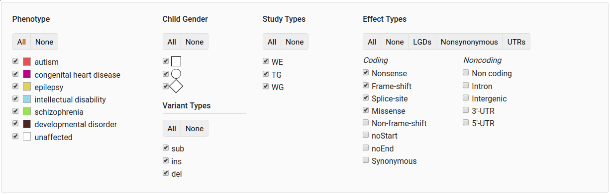

GPF User Interface
==================

The data are organized by datasets.
Each dataset represents a set of families and the available phenotypic and genotypic data for the members of these families.
Typically, a user selects a dataset to operate on first and then uses the applicable views or tools over the selected dataset,
which are organized as tabs (See Figure 1). Alternatively, a user can use the meta-analysis tools that allow simultaneous
queries over all datasets he has access to (See Figure 2). Finally, the system provides a management interface allowing the system administrator
to control the registered users and the datasets they are authorized to access. We provide a brief description of the available tools below.

   Figure 2

Dataset Tools
*************

   Figure 1

Dataset Description
-------------------

The “Dataset Description” provides a high level description of the dataset.
The description can contain the reason for building the dataset, its size and scope,
its rules for access and usage, details of the technology used to generate the phenotypic and genotypic data, and relevant references.

Genotype Browser
----------------

.. figure:: imgs/gpf_screenshots/07-gpf-genotype-browser-genomic.png
   :align: center

   Figure 3

The “Genotype Browser” provides a powerful query interface to the dataset’s genetic variants.
Users can filter variants based on properties of the variants, such as:

   - Their type (SNP, short indel, CNV).
   - Their effect on proteins (i.e. missense, synonymous, LGD, etc.).
   - Whether they are de novo or transmitted, and their frequency.
   - Genomic scores assigned to variants (i.e. phyloP, CADD, MPC, etc.).
   - The genes targeted by the variant and the family the variant occurs in.

Additionally, the user can filter by properties of the target genes, such as:

   - Protection scores (pLI, RVIS, etc.)
   - Pathway membership
   - SFARI Gene score and phenotypic properties associated with individuals in the dataset families.

After the query is set up, the user can preview the variants of interest within the website or download them as an Excel file for further analysis.
Figure 4 shows an example query.

.. figure:: imgs/gpf_screenshots/01-gpf-variants-table.png
   :align: center

   Figure 4

The "Genotype Browser" also provides a graphical preview which displays variants at their location on the corresponding chromosome.

   Graphical preview

Genotype Browser Filters
++++++++++++++++++++++++

The "Genotype Browser", as already mentioned, provides filters for various
properties of variants.

   General filters

Gene sets filter
^^^^^^^^^^^^^^^^

The gene sets filter has support for various preconfigured sets of genes,
published gene sets and De Novo variants gene sets. It provides a dropdown
list of groups of gene sets and a simple search bar from which to select the
desired gene set.

   Groups of gene sets

   Gene sets search bar

   De Novo gene sets

Gene properties
^^^^^^^^^^^^^^^

The gene properties filter has support for filtering based on various
preconfigured gene properties, which are presented as a histogram with two
sliders. The sliders may be moved to select a particular range, or it may
be entered in the fields below the histogram.

   Gene properties

Phenotype filters
^^^^^^^^^^^^^^^^^

   Phenotype filters search bar

   Phenotype filters range selector

Genomic scores filters
^^^^^^^^^^^^^^^^^^^^^^

   Genomic score selector

   Genomic score range selector

Phenotype Browser
-----------------

The “Phenotype Browser” shows the phenotypic data associated with a data set.
The Phenotypic data is organized by instruments applied to individuals, where each instrument has a set of measures.
The user can easily see all of the instruments and all of the measures within each instrument represented by the histograms
of the measures across the individuals in the datasets, split by role and diagnosis. In addition, the “Phenotype Browser” provides
a simple keyword search for measures of interest (see Figure 5) and allows the user to download the data in Excel format for further analysis.

   Figure 5

Enrichment Tool
---------------

The “Enrichment Tool” allows the user to test if a given set of genes is affected more or less by de novo mutations than expected
in the children in the dataset. We, and others, have used such a simple approach to demonstrate that there is functional convergence
of de novo mutations in autism (i.e., damaging de novo mutations in children with autism target synaptic genes and genes encoding
chromatin modifiers) and that the de novo mutation in autism targets similar genes as the de novo mutation in intellectual disability and epilepsy.
The same technique was applied in studies of various other disorders. Moreover, users can use the “Enrichment Tool” over existing
datasets to tests hypotheses driven by their own research against the large amount of genetic data managed by GPF. (See Figure 6)

   Figure 6

Phenotype Tool
--------------

The “Phenotype Tool” (see Figures 7.a and 7.b) is used to study correlation of variants in gene sets and phenotype measures.
A phenotype measure, optional measures to normalize by, and various filters are selected before producing a report.
Additionally, gene sets, symbols and weights are available to filter results by.
The result can be downloaded for later usage.

   Figure 7.a

   Figure 7.b

Dataset Statistics
------------------

"Dataset Statistics" shows the number of people by role (proband, mother, grandfather, etc),
by primary diagnosis, or other relevant phenotypic parameters, as well as the number of families
by pedigree structure and, if applicable, the rates of de novo variants by variant type and effect
and by the person’s role and diagnosis (see Figures 3.a and 3.b).

   Figure 3.a

   Figure 3.b

metaTools
*********

MetaQuery
---------

The “metaQuery” (“All data sets”)

Management Tools
****************

.. toctree::
   :maxdepth: 3

   user_management
