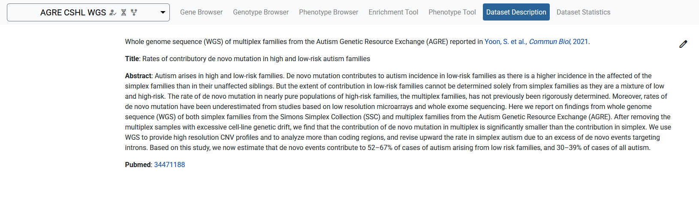
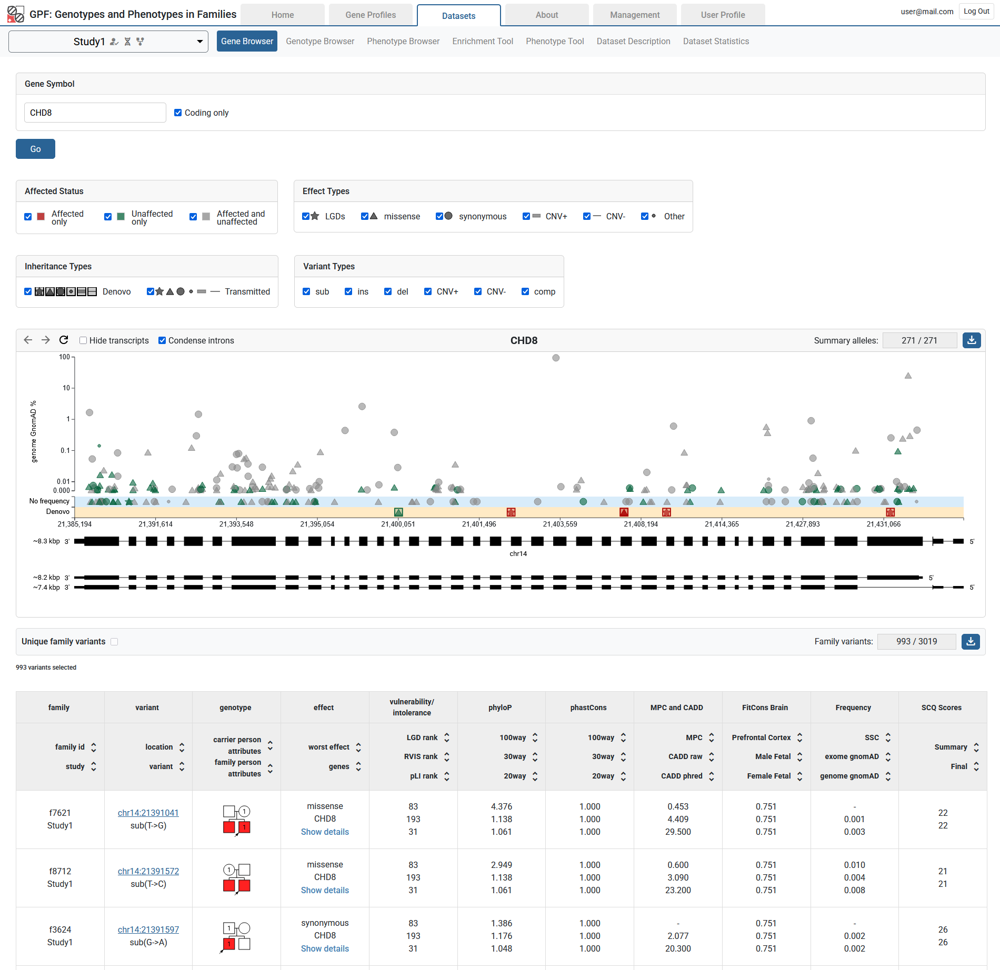

GPF User Interface
==================

This guide will give a brief description of the available tools in GPF.

Depending on the instance's configuration, the user may require permission to access certain datasets. In that case, the user should
log into their account or contact an admin if they don't have one.

The data in the GPF instance is organized into datasets.
Each dataset represents a set of families and the available phenotypic and/or
genotypic data for the members of these families.

To select a dataset, the user can click on the dataset dropdown menu (see fig. 1).
Each dataset has its own selection of available tools, which are organized as tabs (see fig. 2).
The availability of these tools is dependent on the configuration of the dataset.

Additionally the user can click on the navigation button (see fig. 3) to access other functionality.

   Figure 1

|

.. figure:: imgs/gpf_screenshots/dataset-tools.png
   :align: center

   Figure 2

|

   Figure 3

Dataset Description
-------------------

The Dataset Description tool provides an overview of the dataset.
For example it can contain the reason for building the dataset, its size and scope, details of the technology used to
generate the data, rules for access, relevant references and etc.

The description is in Markdown format and can be edited directly from the browser.

Dataset Statistics
------------------

The Dataset Statistics tool provides various overviews of the families in the dataset.
A download button can be clicked to download a .ped file with all individuals in the dataset.

.. figure:: imgs/gpf_screenshots/dataset-statistics-download-all.png
   :align: center

Families by number
##################

A table with the amount of individuals, separated by phenotype and sex.

.. figure:: imgs/gpf_screenshots/families-by-number.png
   :align: center

Families by pedigree
####################

A table of all types of pedigrees and the amount of families for each pedigree.
Each pedigree can be clicked to display its family IDs and a download link for the .ped file.
The table can be filtered by various tags provided by a dropdown menu in the upper-left corner (see fig. 4.1).
The user can download the families found in table via the download button (see fig. 4.2).
Additionally, a legend can be opened in the bottom-right corner (see fig. 4.3).

   Figure 4

De Novo variants
################

Provides a table with the rates of de novo variants, split by variant effect type and the individual’s diagnosis.

Gene Browser
------------

The Gene Browser tool can be used to graphically display a gene's structure (exomes, introns, transcripts) and the dataset's variants found on it. 

The variants can be filtered by different properties. The user can hover over each variant on the plot to show additional information.
The plot can be zoomed (by click-and-drag) to select specific variants in a region.
Below the plot is a table showing the currently selected variants.
Two download buttons are provided - for summary and family variants.

Genotype Browser
----------------

The Genotype Browser tool provides a powerful query interface to the dataset’s genetic variants.
Users can filter by properties of the variants, such as:

   - Their type (SNP, short indel, CNV)
   - Their effect on proteins (i.e. missense, synonymous, LGD, etc.)
   - Whether they are de novo or transmitted, and their frequency
   - Genomic scores assigned to variants (i.e. phyloP, CADD, MPC, etc.)
   - The genes targeted by the variant and the family the variant occurs in

Additionally, the user can filter by properties of the target genes, such as:

   - Protection scores (pLI, RVIS, etc.)
   - Pathway membership
   - SFARI Gene score and phenotypic properties associated with individuals in
     the dataset families

More information on the filters can be found :ref:`here<Filters>`.

.. figure:: imgs/gpf_screenshots/genotype-browser.png
   :align: center

After the query is set up, the user can preview the variants of interest within
the website or download them as an Excel file for further analysis.

Phenotype Browser
-----------------

The Phenotype Browser tool shows the phenotypic data associated with a data set.
The data is organized by instruments applied to individuals, where
each instrument has a set of measures.
These measures are displayed in a table alongside their histograms across the individuals in the datasets (split by role and diagnosis).
A search bar and an instruments dropdown menu are provided.
The table can be downloaded as a spreadsheet file.

.. figure:: imgs/gpf_screenshots/pheno-browser-search.png
   :align: center

Enrichment Tool
---------------

The Enrichment Tool allows the user to test how strongly a given set of genes are affected by de novo mutations.

Such an approach has been used to demonstrate that
there is functional convergence of de novo mutations in autism (i.e., damaging
de novo mutations in children with autism target synaptic genes and genes
encoding chromatin modifiers) and that the de novo mutation in autism targets
similar genes as the de novo mutation in intellectual disability and epilepsy.
The same technique was applied in studies of various other disorders.
Moreover, users can use the Enrichment Tool to tests hypotheses driven by
their own research against the large amount of genetic data managed by GPF.
To use the tool, the user has to choose a gene or a set of genes to test.
Enrichment models can be applies as additional normalization criteria.

Phenotype Tool
--------------

The Phenotype Tool is used to study correlation of variants in gene sets and phenotype measures.
To produce a report, the user selects a phenotype measure and optional measures to normalize by.
Additional :ref:`filters<Filters>` are also provided. The results are available for downloading.

.. figure:: imgs/gpf_screenshots/pheno-tool.png
   :align: center

Autism Gene Profiles
--------------------

The Autism Gene Profiles tool can be used to view a table of statistics about genes in the configured datasets.
The table is interactive - columns can be sorted, toggled and reordered (see video below).
Each gene symbol can be clicked to open the single view for that gene.
Some of the columns represent a statistic for a dataset - their cells can be clicked to open the corresponding genotype browser query.
Rows can be highlighted using the middle mouse button or CTRL / ⌘ + click. Highlighted genes are listed in the bottom right
and can be opened for comparison (see fig. 5).

.. video:: ../_static/agp.mp4
   :width: 100%

|

   Figure 5

Autism Gene Profiles - single view
##################################

The single view is a dedicated view for one or more genes. It contains the information you'd find in the table, but presented in more detail.
For example, scores are presented in the context of the histogram for the whole range of score values.
There are also useful links for external resources such as the UCSC Genome Browser.

Filters
-------

Below is a list of the available filters in GPF.

General Filters
###############

.. figure:: imgs/gpf_screenshots/general-filters.png
   :align: center

   General filters

Present in parent
+++++++++++++++++

This filter allows querying whether the variant is found in a parent and the frequency with which it occurs.
When choosing the frequency, the user can select:

- All variants (via "all")
- Variants that occur less than X % (via "rare")
- Variants that occur between X and Y % (via "interval")
- Variants that occur in only a single individual (via "ultraRare")

Pedigree selector
+++++++++++++++++

The pedigree selector has a dropdown to choose a criteria from:

.. figure:: imgs/gpf_screenshots/pedigree-selector.png
   :align: center

Gene symbols filter
##############

Specific genes can be queried for using this filter.
Gene symbols can be listed as comma or newline separated values.

.. figure:: imgs/gpf_screenshots/gene-symbols.png
   :align: center

Gene sets filter
################

This filter allows the user to limit his query to a specific set of genes.
We provide collections of published gene sets as well as sets based on de novo variants in our datasets.
A download link is available for the selected gene set.

.. figure:: imgs/gpf_screenshots/gene-sets.png
   :align: center

.. figure:: imgs/gpf_screenshots/gene-sets-denovo.png
   :align: center

Gene scores
###########

This filter allows the user to limit his query to a range of values for a given gene score.
The gene score is presented as a histogram with two sliders which can be moved to select a range.
The text next to the left and right sliders represents the amount of genes excluded from the selection.
The text in the middle is the amount of genes that are selected.
A download link is available for the gene scores. 

.. figure:: imgs/gpf_screenshots/gene-scores.png
   :align: center

Regions filter
##############

This filter can be used to limit the query to a specific genomic region.
The format is a comma or a newline separate list of a region strings.
Each region string follows a "CHR:POS" or "CHR:POS_BEG-POS_END" format.

The user can also filter by phenotypic measures through the "Advanced" tab.
A measure is selected and the user is provided with a histogram, similar to the `Gene scores`_ filter.

.. figure:: imgs/gpf_screenshots/family-filter-advanced.png
   :align: center

Study filters
#############

This filter can be found on genotype data groups and allows selecting a subset of its studies.

Genomic scores filters
######################

This filter allows the user to limit his query to a range of values for a given genomic score, similar to the `Gene scores`_ filter.
The user can filter by multiple genomic scores.
This filter is dependent on variant annotation during genotype data import.

.. figure:: imgs/gpf_screenshots/genomic-scores.png
   :align: center

Family and person filters
##############

These two filters have identical interfaces, but work on families or individuals respectively.
Specific families or individuals can be queried for using the "IDs" tab.
IDs can be listed as comma or newline separated values.

.. figure:: imgs/gpf_screenshots/family-ids.png
   :align: center

Unique family variants 
######################

This toggles how identical family variants from different studies are shown.

