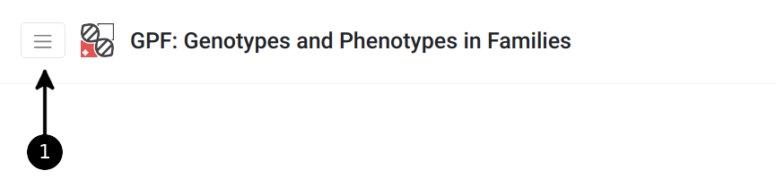
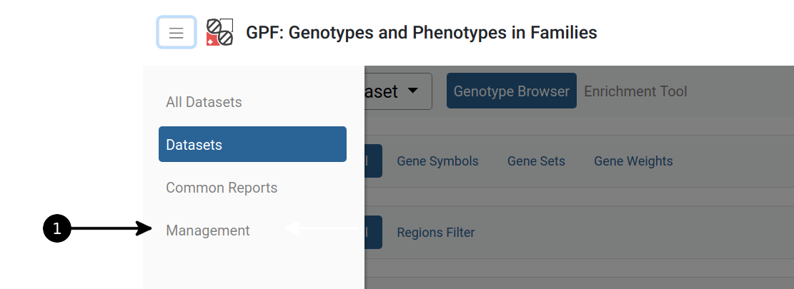
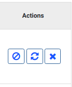
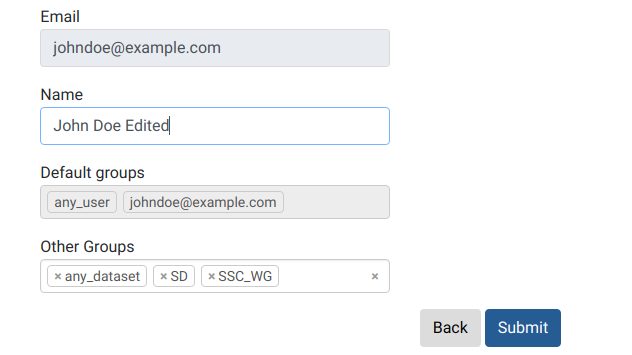
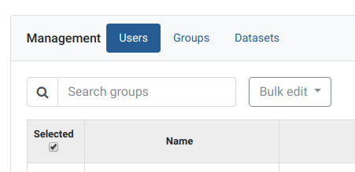
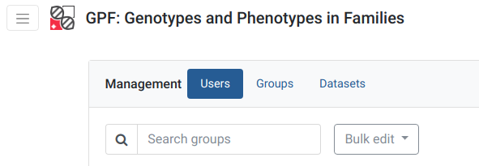
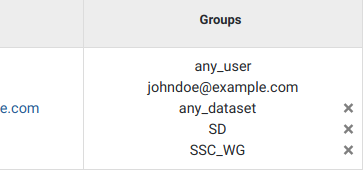
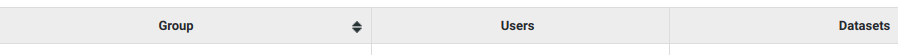
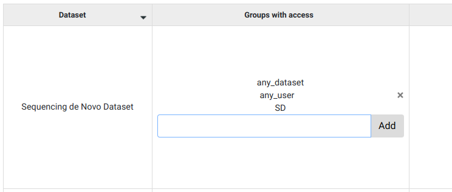

GPF User Management
===================

All options concerning Management can only be found by **admin** users
in the *Management* tab from the upper left corner menu

Quick start guide
-----------------

How to create a new user?
+++++++++++++++++++++++++

Open **sidebar** menu.

.. warning::
   change screenshot

Open **Management** page.

.. warning::
   change screenshot

Above users management table click on **Create user**.
   
.. figure:: imgs/user_management/create-user-1.png
   :scale: 50
   :alt: User list table
   :align: center

Enter **name** and **email** of the new user, then click **Create**.
   
.. figure:: imgs/user_management/create-user-2.png
   :scale: 50
   :alt: User list table
   :align: center
.. figure:: imgs/user_management/create-user-3.png
   :scale: 50
   :alt: User list table
   :align: center

The **new user** will show on top of the users table **ready to be edited** further.
   
.. figure:: imgs/user_management/create-user-4.png
   :scale: 50
   :alt: User list table
   :align: center

How to specify permissions for a given user?
++++++++++++++++++++++++++++++++++++++++++++

.. figure:: imgs/user_management/add-remove-group-num.png
   :scale: 50
   :alt: Interface for editing user groups
   :align: center

   Interface for editing user groups

Users
-----

Actions towards users
+++++++++++++++++++++

Every user is represented by a row on the table shown in the *Users* category
on the *Management* tab. The delete user, remove/reset password actions can be
seen in the *Actions* column for every user in question.

   Interface for actions on users

.. _reset-password:

Reset password
^^^^^^^^^^^^^^

Clicking on the middle icon in the *Actions* column, resets the password of the
user shown on the current row. This button will send the user in question an
email with a corresponding link, obligating them to choose a new password for
their account.

Remove password
^^^^^^^^^^^^^^^

Clicking on the utmost left icon in the *Actions* column, removes the password
of the user shown on the current row. After completing this action, in order
for the user in question to acquire a new password, clicking on the
:ref:`reset-password` button will be necessary.

Delete user
^^^^^^^^^^^

Clicking on the utmost right 'X' icon in the *Actions* column, deletes the user
shown on the current row.

Create user
^^^^^^^^^^^

Admins can create new users and associate them with groups.
The Create user button is located on the top right corner of the Users page.

.. figure:: imgs/user_management/u-img2.png
   :width: 450px
   :alt: Create user interface
   :align: center

   Create user interface

This button will open a page, where the new user's email, name or additional
groups can be entered. After every mandatory field is filled, clicking the
*Submit* button will create a new user.

.. figure:: imgs/user_management/u-img3.png
   :width: 400px
   :alt: Create user dialog
   :align: center

   Create user dialog

After a new user is added, in order for them to log into their newly created
account, an admin should reset the user’s password. See :ref:`reset-password`
for more.

.. figure:: imgs/user_management/u-img4.png
   :scale: 70%
   :alt: Has password checkbox
   :align: center

   Has password checkbox

Whether a user has a password or not can be seen in the 'Has password' column,
where a tick symbol indicates 'yes' and empty cell 'no'.

Edit user
^^^^^^^^^

Any user's email or default groups cannot be changed but the *Name* of the
user can. Clicking on any user's email address will lead to a page, where their
user name can be changed.

   Edit user dialog

Clicking *Submit* will remember the new changes.

Actions towards groups
++++++++++++++++++++++

Search groups
^^^^^^^^^^^^^

The search bar for groups is located on the upper left in the *Users* category
in the *Management* tab.

   Management tab

Add/Remove group from a user
^^^^^^^^^^^^^^^^^^^^^^^^^^^^

Only admins can assign or remove groups.
Interacting with users is achieved via the *Users* category in the *Management*
tab from the menu.

   Select users management in management tab

In order to assign a new group to a user, click on the blue link of the user’s
email address.

.. figure:: imgs/user_management/g-img1.png
   :width: 450px
   :alt: List of users
   :align: center

   List of users

This will open a page, allowing for the selected user’s information to be edited.
Groups can be added by using the *Other Groups* dropdown menu option
or removed by clicking the 'X' in the same menu option.

.. figure:: imgs/user_management/add-remove-group.png
   :width: 400px
   :alt: Edit user groups
   :align: center

   Edit user groups

Remove group from user - shortcut
^^^^^^^^^^^^^^^^^^^^^^^^^^^^^^^^^

Next to every user's groups, an 'X' symbol can be found. By clicking it, the
selected group will be removed from the user.

   Remove groups from user

Default groups cannot be removed.

Add/Remove groups from multiple users at once
^^^^^^^^^^^^^^^^^^^^^^^^^^^^^^^^^^^^^^^^^^^^^

.. figure:: imgs/user_management/u-img10.png
   :scale: 80%
   :alt: Select multiple users
   :align: center

   Select multiple users

Using the boxes in the 'Select' column, multiple users can be selected at once.
Ticking the box under select will select all, while clicking it a second time
will select none.

After the desired users are selected, by choosing an option from the
*Bulk edit* dropdown menu, groups can be either removed or added to them.

.. figure:: imgs/user_management/u-img11.png
   :width: 400px
   :alt: Bulk edit of multiple users
   :align: center

   Bulk edit of multiple users

After choosing an option, a new page will appear, allowing you to pick groups
to remove or add.

.. _user_dataset_groups:

Groups
------

Groups are entities that associate users with datasets.
If a user wishes to access a certain dataset, he has to belong to a group
containing that dataset. Users and datasets can be in multiple groups
simultaneously.

When a new user or dataset is created, they are automatically assigned to
groups with their corresponding names.

.. figure:: imgs/user_management/g-img1.png
   :width: 450px
   :alt: Example of newly added user
   :align: center

   Example of newly added user

Special Groups
++++++++++++++

Admin
^^^^^
Users assigned to the admin group, have all permissions.
Only admin users can view or interact with other users, groups or datasets.

Anonymous
^^^^^^^^^

*anonymous@seqpipe.org* is a group that all unregistered users belong to.
They lack permissions for accessing most of the datasets.
Inaccessible datasets are shown in grey color.

.. figure:: imgs/user_management/g-img2.png
   :width: 450px
   :alt: Example of a dataset accessible to all users
   :align: center

   Example of a dataset accessible to all users

Hidden
^^^^^^

Datasets could belong to a group called `hidden`.
This group indicates which datasets should stay hidden (instead of showing them
in grey color) in the dropdown menu on the dataset page for users
without access permissions.

.. figure:: imgs/user_management/g-img3.png
   :width: 450px
   :alt: Example of a hidden dataset
   :align: center

   Example of a hidden dataset, visible after user is logged in

In this case, *Denovo DB Dataset* is an option for the registered user,
as opposed to when an anonymous user is opening the menu in the previous
example.

Any user
^^^^^^^^

Certain datasets are visible to every registered user.
They belong to the *any_user* group which is automatically assigned to every
account and cannot be removed.

Any dataset
^^^^^^^^^^^

*any_dataset* is a group that contains all of the available datasets.
Admins are usually subscribed to this group.

Sorting groups
++++++++++++++

In the *Groups* tab on the *Management* menu, the groups column can be sorted
by clicking on the arrows at the end of the *Group* column title.

   Interface for sotring groups

By clicking on the down arrow, it allows the existing groups to be sorted
alphabetically in descending order, while the up arrow sorts them in ascending
order.

Dataset access
--------------

In the *Datasets* tab on the *Management* menu, GUI users can observe
information about which users have access to a dataset or which groups
does a dataset belong to.

Adding group to a dataset
+++++++++++++++++++++++++
In the *Datasets* tab, by typing group names in the text bar in the
'Groups with access' column, and then clicking 'Add', existing groups can
be assigned to datasets.

   Example of changing groups of a dataset
