GPF User Management
===================

All options concerning **User Management** can only be found by **admin** users
in the **Management** tab from the upper left corner menu

Open **sidebar** menu.

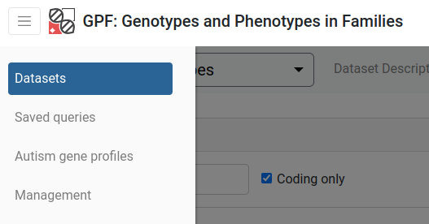

Open **Management** page.

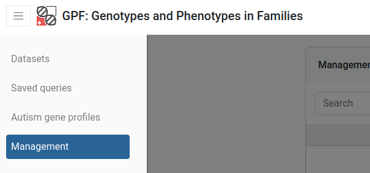

Users
-----

Interacting with users is achieved via the **Users** category in the **Management**
tab from the menu. Every user is represented by a row on the table shown in the **Users** category.

How to create a new user?
+++++++++++++++++++++++++

Above users management table click on **Create user**.
   
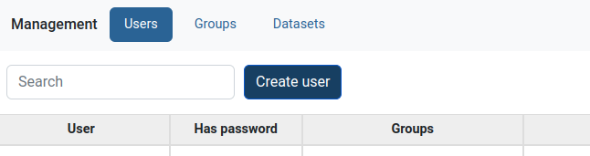

Enter **name** and **email** of the new user, then click **Create**.
   
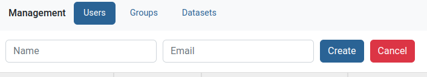
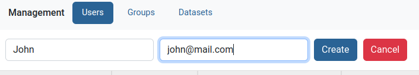

The **new user** will show on top of the users table **ready to be edited** further.
   
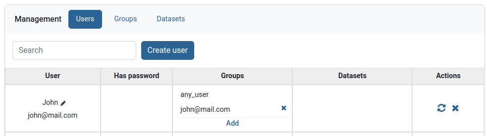

.. note::
   To **login with the new user** a password must be set. This could be accomplished from:
      * The **login interface** by clicking on **Forgotten password**.
      * The **Users Management table** by clicking on a user's **Reset password** button.

How to specify permissions for a given user?
++++++++++++++++++++++++++++++++++++++++++++

Find the user then click on the **Add** button in the **Groups column**

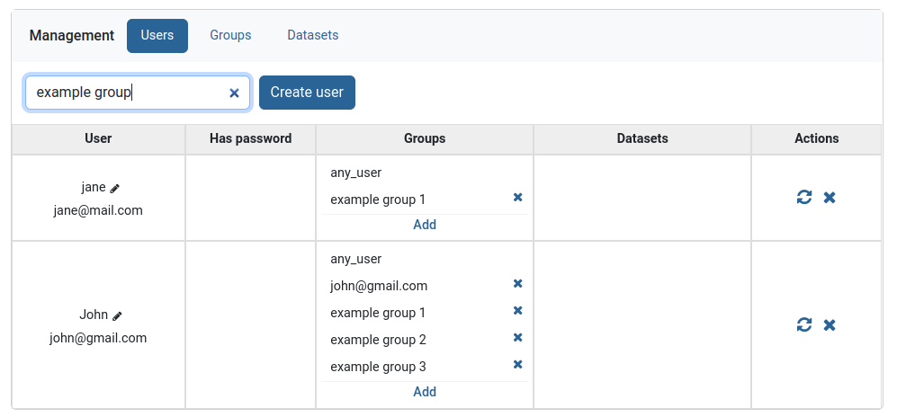

A small menu will appear, that **lists all unadded** groups. **Search** the group and **click** on it.

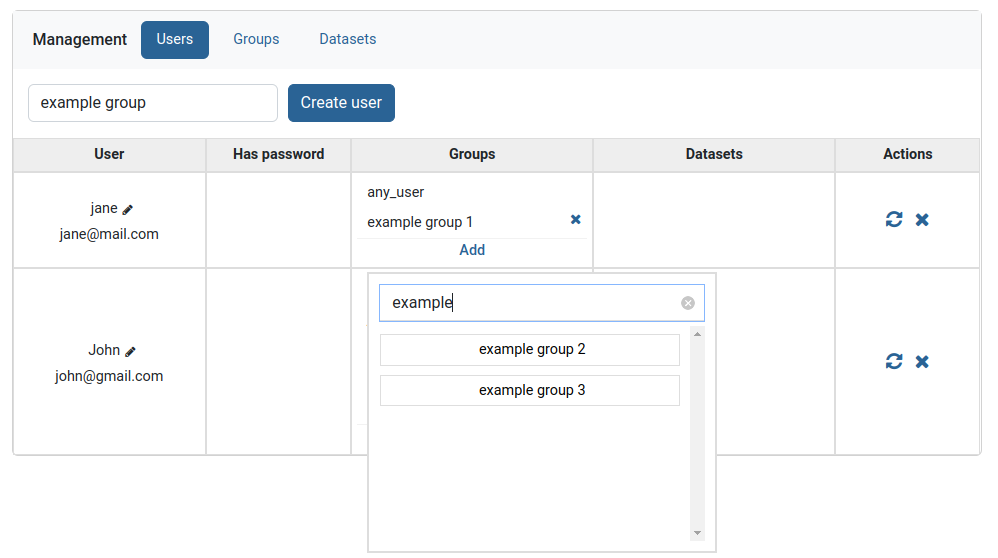

The group will now appear in the list of groups in the **Groups** column.
To now **remove it** click on the small **x** button to the right of the group and then **confirm removal**. 

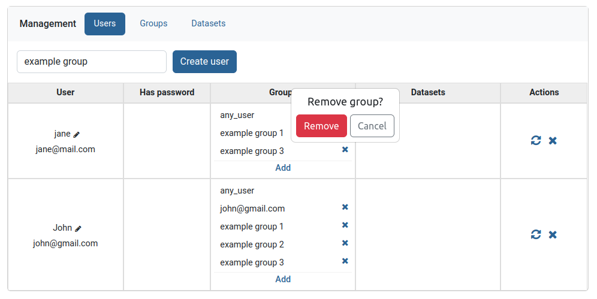

Reset password
+++++++++++++++++++++++++

Clicking on the left icon in the **Actions** column, **resets the password** of the
user shown on the current row. This button will send the user in question an
**email with a corresponding link**, obligating them to choose a new password for
their account.

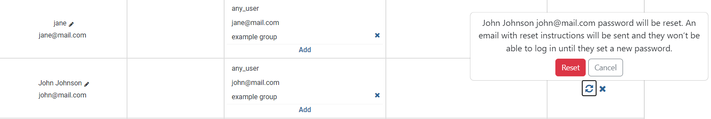

Delete user
+++++++++++++++++++++++++

Clicking on the utmost right **X** button in the **Actions** column, **deletes the user**
shown on the current row.

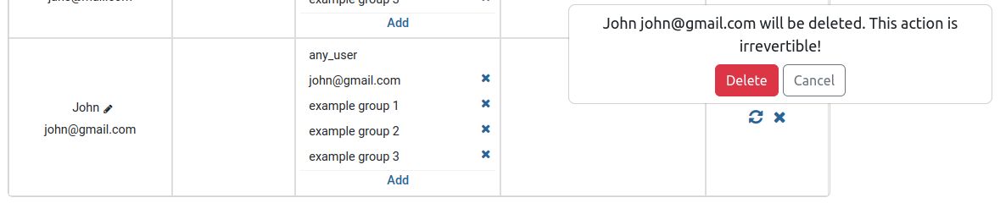

Edit user name
+++++++++++++++++++++++++

Clicking on the pencil icon in the **User** column, allows editing the name of the
user shown on the current row.

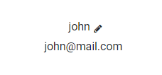

**Input field** will show showing the **current user name**.

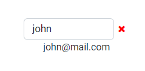

**Change** it to something else (cannot use **empty names** or names that are **too short**) and **press enter**.

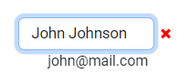

Groups
------

Groups are entities that associate users with datasets.
If a user wishes to access a certain dataset, he has to belong to a group
containing that dataset. Users and datasets can be in multiple groups
simultaneously. The easiest way to add multiple users and datasets to a group is through the groups table view.

When a new user or dataset is created, they are automatically assigned to
groups with their corresponding names.

.. figure:: imgs/user_management/g-img1.png
   :width: 450px
   :alt: Example of newly added user
   :align: center

   Example of newly added user

Special Groups
++++++++++++++

Admin
^^^^^
Users assigned to the admin group, have all permissions.
Only admin users can view or interact with other users, groups or datasets.

Anonymous
^^^^^^^^^

*anonymous@seqpipe.org* is a group that all unregistered users belong to.
They lack permissions for accessing most of the datasets.
Inaccessible datasets are shown in grey color.

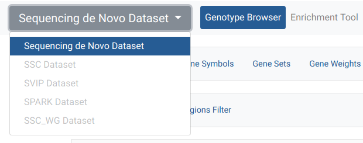

   Example of a dataset accessible to all users

Hidden
^^^^^^

Datasets could belong to a group called `hidden`.
This group indicates which datasets should stay hidden (instead of showing them
in grey color) in the dropdown menu on the dataset page for users
without access permissions.

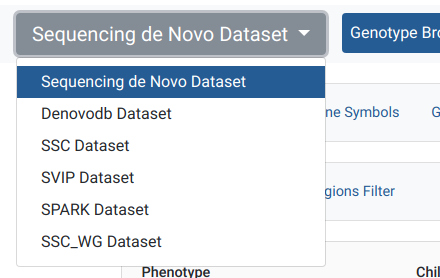

   Example of a hidden dataset, visible after user is logged in

In this case, *Denovo DB Dataset* is an option for the registered user,
as opposed to when an anonymous user is opening the menu in the previous
example.

Any user
^^^^^^^^

Certain datasets are visible to every registered user.
They belong to the *any_user* group which is automatically assigned to every
account and cannot be removed.

Any dataset
^^^^^^^^^^^

*any_dataset* is a group that contains all of the available datasets.
Admins are usually subscribed to this group.

Creating group
++++++++++++++

In the **Groups** tab on the *Management* menu,
above **groups management table** click on **Create group**.

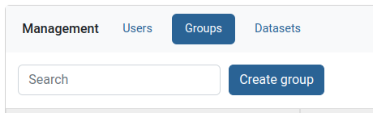

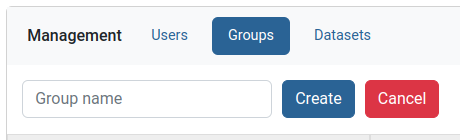

Type the new group name and press **create**.

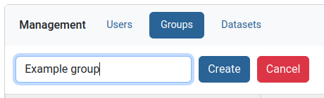

To finish group creation you need to add at least one user or one dataset to the group,
because empty groups cannot exist.

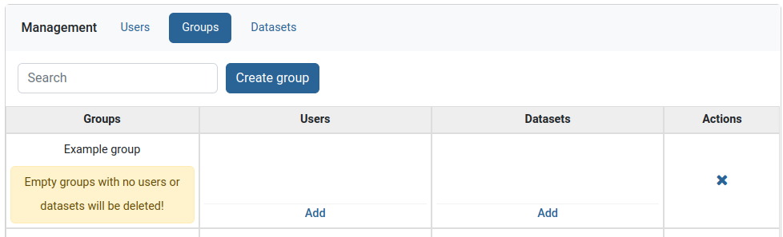

Adding users and dataset to group
+++++++++++++++++++++++++++++++++

Find the group you want to edit then add users and datasets through the **Add** buttons in users and datasets columns.

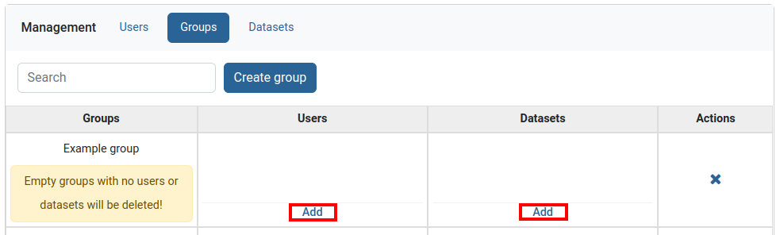

Dataset access
--------------

In the **Datasets** tab on the **Management** menu, admins can observe
information about which users have access to a dataset or which groups
does a dataset belong to. The easiest way to add a dataset to multiple groups is through the **Datasets table view**. 

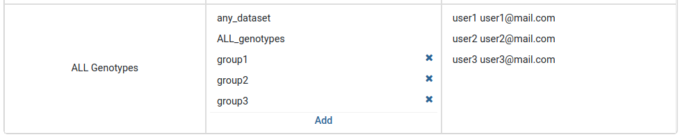

Adding group to a dataset
+++++++++++++++++++++++++

Find the dataset you want to edit then add groups through the **Add** button in group column.

