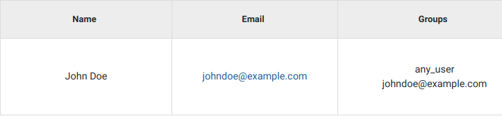

GPF User Management
===================

Open **sidebar** menu.

.. warning::
   change screenshot
.. figure:: imgs/user_management/01-management-menu.png
   :scale: 50
   :alt: Management menu
   :align: center

Open **Management** page.

.. warning::
   change screenshot
.. figure:: imgs/user_management/02-user-management-menu.png
   :scale: 50
   :alt: User management menu
   :align: center

All options concerning Management can only be found by **admin** users
in the *Management* tab from the upper left corner menu

Users
-----

Every user is represented by a row on the table shown in the **Users** category
on the **Management** tab.

How to create a new user?
+++++++++++++++++++++++++

Above users management table click on **Create user**.
   
.. figure:: imgs/user_management/create-user-1.png
   :scale: 50
   :alt: User list table
   :align: center

Enter **name** and **email** of the new user, then click **Create**.
   

.. figure:: imgs/user_management/create-user-3.png
   :scale: 50
   :alt: User list table
   :align: center

The **new user** will show on top of the users table **ready to be edited** further.
   
.. figure:: imgs/user_management/create-user-4.png
   :scale: 50
   :alt: User list table
   :align: center

.. note::
   To **login with the new user** a password must be set. This could be accomplished from:
      * The **login interface** by clicking on **Forgotten password**.
      * The **Users Management table** by clicking on a user's **Reset password** button.

How to specify permissions for a given user?
++++++++++++++++++++++++++++++++++++++++++++

Find the user then click on the **Add** button in the **Groups column**

.. figure:: imgs/user_management/edit-user-1.png
   :scale: 50
   :alt: Interface for editing user groups
   :align: center

A small menu will appear, that **lists all unadded** groups. **Search** the group and **click** on it.

The group will now appear in the list of groups in the **Groups** column.
To now **remove it** click on the small **x** button to the right of the group and then **confirm removal**. 

Reset password
+++++++++++++++++++++++++

Clicking on the left icon in the **Actions** column, **resets the password** of the
user shown on the current row. This button will send the user in question an
**email with a corresponding link**, obligating them to choose a new password for
their account.

.. figure:: imgs/user_management/reset-user-password.png
   :scale: 50
   :alt: Interface for editing user groups
   :align: center

Delete user
+++++++++++++++++++++++++

Clicking on the utmost right **X** button in the **Actions** column, **deletes the user**
shown on the current row.

Edit user name
+++++++++++++++++++++++++

Clicking on the pencil icon in the **User** column, allows editing the name of the
user shown on the current row.

.. figure:: imgs/user_management/change-username-1.png
   :scale: 50
   :alt: Interface for editing user groups
   :align: center

**Input field** will show showing the **current user name**.

**Change** it to something else (cannot use **empty names** or names that are **too short**) and **press enter**.

.. figure:: imgs/user_management/change-username-3.png
   :scale: 50
   :alt: Interface for editing user groups
   :align: center

Actions towards groups
++++++++++++++++++++++

Search groups
^^^^^^^^^^^^^

The search bar for groups is located on the upper left in the *Users* category
in the *Management* tab.

.. figure:: imgs/user_management/u-img6.png
   :width: 450px
   :alt: Management tab
   :align: center

   Management tab

Add/Remove group from a user
^^^^^^^^^^^^^^^^^^^^^^^^^^^^

Only admins can assign or remove groups.
Interacting with users is achieved via the *Users* category in the *Management*
tab from the menu.

.. figure:: imgs/user_management/u-img7.png
   :width: 450px
   :alt: Select users management in management tab
   :align: center

   Select users management in management tab

In order to assign a new group to a user, click on the blue link of the user’s
email address.

   List of users

This will open a page, allowing for the selected user’s information to be edited.
Groups can be added by using the *Other Groups* dropdown menu option
or removed by clicking the 'X' in the same menu option.

.. figure:: imgs/user_management/add-remove-group.png
   :width: 400px
   :alt: Edit user groups
   :align: center

   Edit user groups

Remove group from user - shortcut
^^^^^^^^^^^^^^^^^^^^^^^^^^^^^^^^^

Next to every user's groups, an 'X' symbol can be found. By clicking it, the
selected group will be removed from the user.

.. figure:: imgs/user_management/u-img9.png
   :width: 350px
   :alt: Remove groups from user
   :align: center

   Remove groups from user

Default groups cannot be removed.

Add/Remove groups from multiple users at once
^^^^^^^^^^^^^^^^^^^^^^^^^^^^^^^^^^^^^^^^^^^^^

.. figure:: imgs/user_management/u-img10.png
   :scale: 80%
   :alt: Select multiple users
   :align: center

   Select multiple users

Using the boxes in the 'Select' column, multiple users can be selected at once.
Ticking the box under select will select all, while clicking it a second time
will select none.

After the desired users are selected, by choosing an option from the
*Bulk edit* dropdown menu, groups can be either removed or added to them.

.. figure:: imgs/user_management/u-img11.png
   :width: 400px
   :alt: Bulk edit of multiple users
   :align: center

   Bulk edit of multiple users

After choosing an option, a new page will appear, allowing you to pick groups
to remove or add.

.. _user_dataset_groups:

Groups
------

Groups are entities that associate users with datasets.
If a user wishes to access a certain dataset, he has to belong to a group
containing that dataset. Users and datasets can be in multiple groups
simultaneously.

When a new user or dataset is created, they are automatically assigned to
groups with their corresponding names.

   Example of newly added user

Special Groups
++++++++++++++

Admin
^^^^^
Users assigned to the admin group, have all permissions.
Only admin users can view or interact with other users, groups or datasets.

Anonymous
^^^^^^^^^

*anonymous@seqpipe.org* is a group that all unregistered users belong to.
They lack permissions for accessing most of the datasets.
Inaccessible datasets are shown in grey color.

.. figure:: imgs/user_management/g-img2.png
   :width: 450px
   :alt: Example of a dataset accessible to all users
   :align: center

   Example of a dataset accessible to all users

Hidden
^^^^^^

Datasets could belong to a group called `hidden`.
This group indicates which datasets should stay hidden (instead of showing them
in grey color) in the dropdown menu on the dataset page for users
without access permissions.

   Example of a hidden dataset, visible after user is logged in

In this case, *Denovo DB Dataset* is an option for the registered user,
as opposed to when an anonymous user is opening the menu in the previous
example.

Any user
^^^^^^^^

Certain datasets are visible to every registered user.
They belong to the *any_user* group which is automatically assigned to every
account and cannot be removed.

Any dataset
^^^^^^^^^^^

*any_dataset* is a group that contains all of the available datasets.
Admins are usually subscribed to this group.

Sorting groups
++++++++++++++

In the *Groups* tab on the *Management* menu, the groups column can be sorted
by clicking on the arrows at the end of the *Group* column title.

   Interface for sotring groups

By clicking on the down arrow, it allows the existing groups to be sorted
alphabetically in descending order, while the up arrow sorts them in ascending
order.

Dataset access
--------------

In the *Datasets* tab on the *Management* menu, GUI users can observe
information about which users have access to a dataset or which groups
does a dataset belong to.

Adding group to a dataset
+++++++++++++++++++++++++
In the *Datasets* tab, by typing group names in the text bar in the
'Groups with access' column, and then clicking 'Add', existing groups can
be assigned to datasets.

.. figure:: imgs/user_management/d-img1.png
   :width: 450px
   :alt: Example of changing groups of a dataset
   :align: center

   Example of changing groups of a dataset
