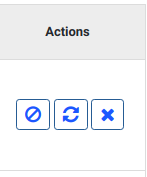
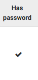
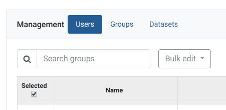
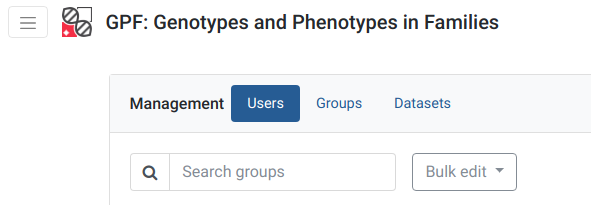
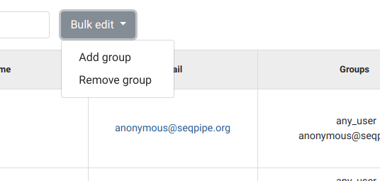

Users
-----

Actions towards users
+++++++++++++++++++++

Every user is represented by a row on the table shown in the *Users* category 
on the *Management* tab. The delete user, remove/reset password actions can be 
seen in the *Actions* column for every user in question.

   
   Interface for actions on users

.. _reset-password:

Reset password
^^^^^^^^^^^^^^

Clicking on the middle icon in the *Actions* column, resets the password of the 
user shown on the current row. This button will send the user in question an 
email with a corresponding link, obligating them to choose a new password for 
their account.

Remove password
^^^^^^^^^^^^^^^

Clicking on the utmost left icon in the *Actions* column, removes the password 
of the user shown on the current row. After completing this action, in order 
for the user in question to acquire a new password, clicking on the 
:ref:`reset-password` button will be necessary.

Delete user
^^^^^^^^^^^

Clicking on the utmost right 'X' icon in the *Actions* column, deletes the user 
shown on the current row.

Create user
^^^^^^^^^^^

Admins can create new users and associate them with groups.
The Create user button is located on the top right corner of the Users page.

   
   Create user interface

This button will open a page, where the new user's email, name or additional 
groups can be entered. After every mandatory field is filled, clicking the 
*Submit* button will create a new user.

   
   Create user dialog

After a new user is added, in order for them to log into their newly created 
account, an admin should reset the user’s password. See :ref:`reset-password` 
for more.

   
   Has password checkbox

Whether a user has a password or not can be seen in the 'Has password' column,
where a tick symbol indicates 'yes' and empty cell 'no'.

Edit user
^^^^^^^^^

Any user's email or default groups cannot be changed but the *Name* of the 
user can. Clicking on any user's email address will lead to a page, where their 
user name can be changed.

   
   Edit user dialog

Clicking *Submit* will remember the new changes.

Actions towards groups
^^^^^^^^^^^^^^^^^^^^^^

Search groups
^^^^^^^^^^^^^

The search bar for groups is located on the upper left in the *Users* category 
in the *Management* tab.

   
   Management tab

Add/Remove group from a user
^^^^^^^^^^^^^^^^^^^^^^^^^^^^

Only admins can assign or remove groups.
Interacting with users is achieved via the *Users* category in the *Management* 
tab from the menu.

   
   Select users management in management tab

In order to assign a new group to a user, click on the blue link of the user’s 
email address.

.. figure:: imgs/g-img1.png
   :width: 450px
   :alt: List of users
   :align: center
   
   List of users

This will open a page, allowing for the selected user’s information to be edited.
Groups can be added by using the *Other Groups* dropdown menu option 
or removed by clicking the 'X' in the same menu option.

   
   Edit user groups

Remove group from user - shortcut
^^^^^^^^^^^^^^^^^^^^^^^^^^^^^^^^^

Next to every user's groups, an 'X' symbol can be found. By clicking it, the 
selected group will be removed from the user.

   
   Remove groups from user

Default groups cannot be removed.

Add/Remove groups from multiple users at once
^^^^^^^^^^^^^^^^^^^^^^^^^^^^^^^^^^^^^^^^^^^^^

   
   Select multiple users

Using the boxes in the 'Select' column, multiple users can be selected at once.
Ticking the box under select will select all, while clicking it a second time 
will select none.

After the desired users are selected, by choosing an option from the
*Bulk edit* dropdown menu, groups can be either removed or added to them.

   
   Bulk edit of multiple users

After choosing an option, a new page will appear, allowing you to pick groups 
to remove or add.
