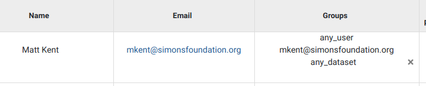
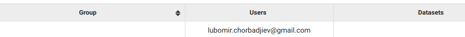

Groups
------

Groups are entities that associate users with datasets.
If a user wishes to access a certain dataset, he has to belong to a group 
containing that dataset. Users and datasets can be in multiple groups 
simultaneously.

When a new user or dataset is created, they are automatically assigned to 
groups with their corresponding names.

   
   Example of newly added user

Special Groups
++++++++++++++

Admin
^^^^^
Users assigned to the admin group, have all permissions.
Only admin users can view or interact with other users, groups or datasets.

Anonymous
^^^^^^^^^

*anonymous@seqpipe.org* is a group that all unregistered users belong to.
They lack permissions for accessing most of the datasets.
Inaccessible datasets are shown in grey color.

.. figure:: imgs/g-img2.png
   :width: 450px
   :alt: Example of a dataset accessible to all users
   :align: center
   
   Example of a dataset accessible to all users

Hidden
^^^^^^

Datasets could belong to a group called `hidden`.
This group indicates which datasets should stay hidden (instead of showing them 
in grey color) in the dropdown menu on the dataset page for users 
without access permissions.

.. figure:: imgs/g-img3.png
   :width: 450px
   :alt: Example of a hidden dataset
   :align: center
   
   Example of a hidden dataset, visible after user is logged in

In this case, *Denovo DB Dataset* is an option for the registered user,
as opposed to when an anonymous user is opening the menu in the previous 
example.

Any user
^^^^^^^^

Certain datasets are visible to every registered user.
They belong to the *any_user* group which is automatically assigned to every 
account and cannot be removed.

Any dataset
^^^^^^^^^^^

*any_dataset* is a group that contains all of the available datasets.
Admins are usually subscribed to this group.

Sorting groups
++++++++++++++

In the *Groups* tab on the *Management* menu, the groups column can be sorted 
by clicking on the arrows at the end of the *Group* column title.

   
   Interface for sotring groups

By clicking on the down arrow, it allows the existing groups to be sorted 
alphabetically in descending order, while the up arrow sorts them in ascending 
order.
