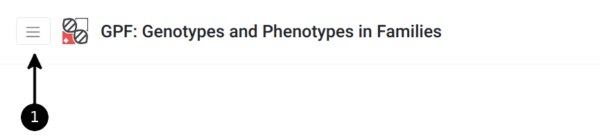
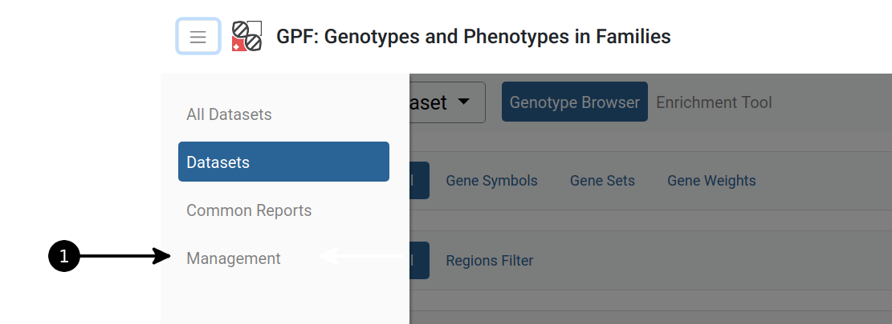
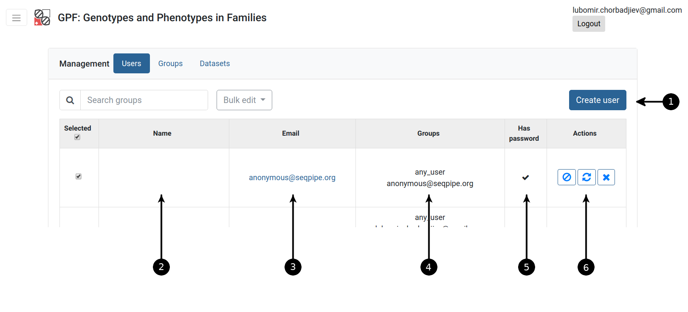
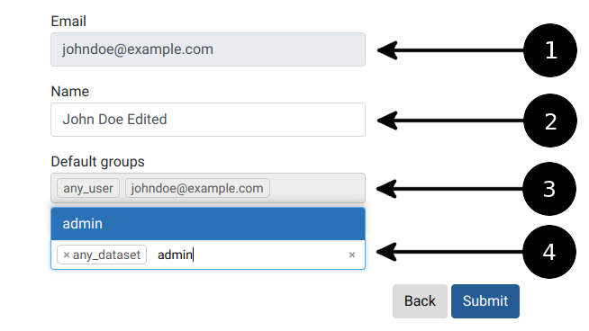

GPF User Management documentation
=================================

All options concerning Management can only be found by **admin** users
in the *Management* tab from the upper left corner menu

Quick start guide
-----------------

   Management menu

   User management menu

   Users list: 1 - create new user button; 2 - the name of
   the user if specified; 3 - user email; 4 - list of groups
   the user belongs to; 5 -

How to create new user?
+++++++++++++++++++++++

   Interface for sotring groups

How to specify permissions for given user?
++++++++++++++++++++++++++++++++++++++++++

